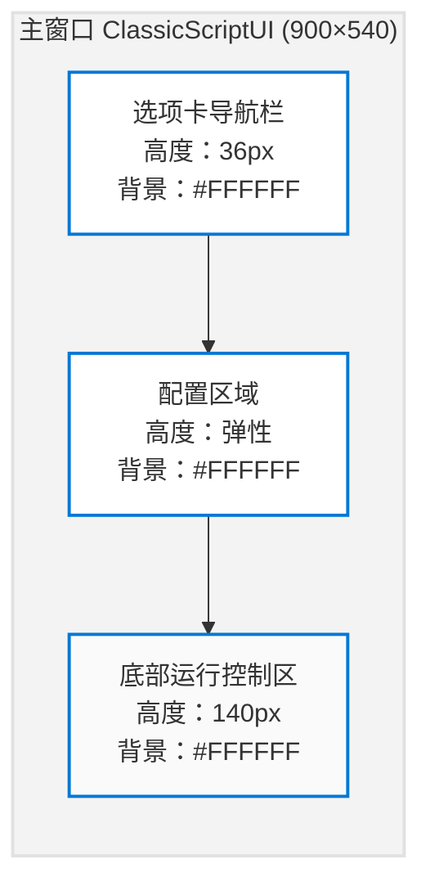
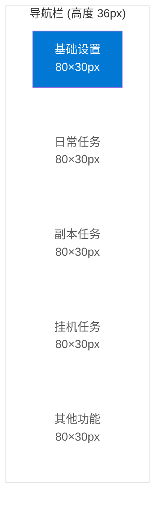
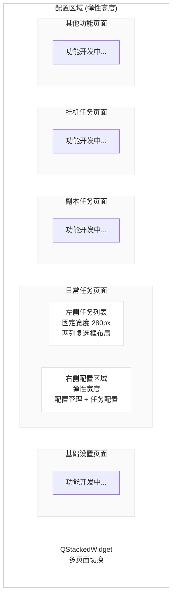
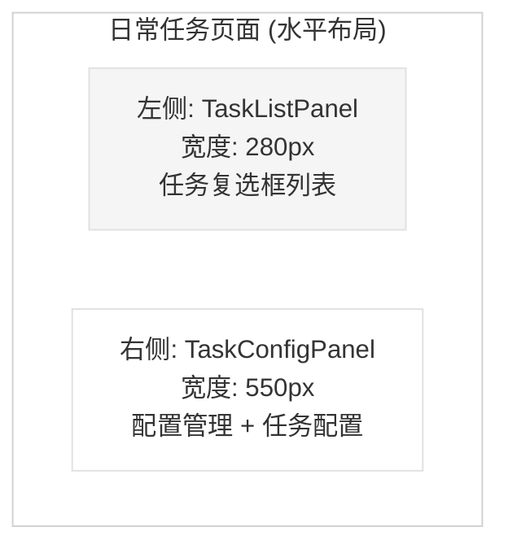
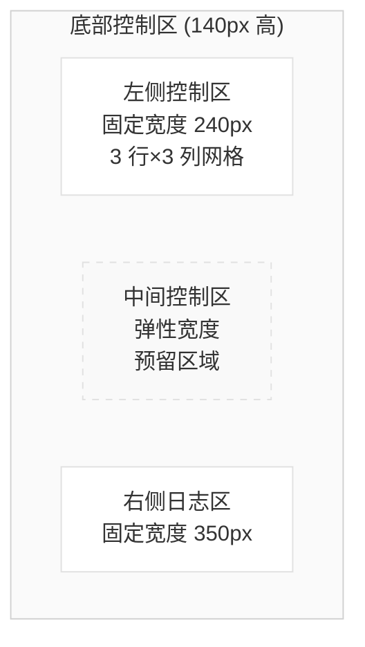
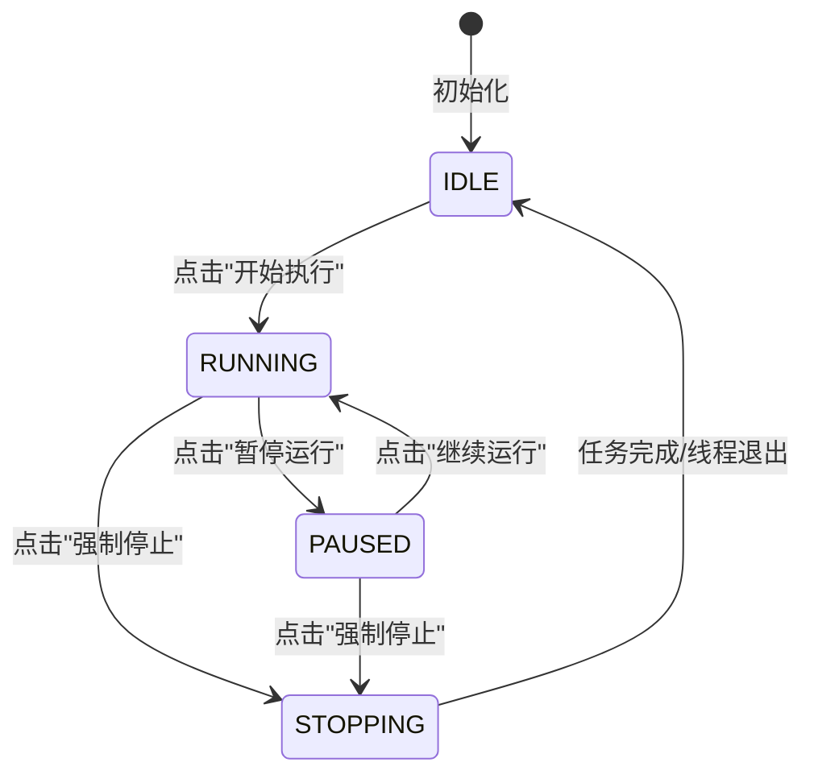

# UI配置文档

本文档记录项目中所有界面元素的尺寸参数和样式配置，便于后续查阅和维护。

## 1. 整体窗口预览与参数配置

### 1.1 整体窗口预览图



### 1.2 整体窗口参数配置表

| 参数名称 | 参数值 | 说明 |
|----------|--------|------|
| 窗口标题 | config.app_name | 主窗口标题（默认："糊批解放器"） |
| 窗口宽度 | 900px | 固定宽度 |
| 窗口高度 | 540px | 固定高度 |
| 窗口背景色 | #F3F3F3 | 主窗口背景色 |
| 主布局类型 | QVBoxLayout | 垂直布局 |
| 主布局边距 | (0, 0, 0, 0) | 左、上、右、下边距均为 0 |
| 主布局间距 | 0px | 各区域之间无间距 |

**代码位置：** `src/ui/main_window.py` (L553-L621)

## 2. 各区域预览与参数配置

### 2.1 顶部导航栏区域

#### 2.1.1 区域预览图



#### 2.1.2 参数配置表

| 参数名称 | 参数值 | 说明 |
|----------|--------|------|
| 区域高度 | 36px | 固定高度 |
| 背景色 | #FFFFFF | 白色背景 |
| 底部边框 | 1px solid #E1E1E1 | 浅灰色边框 |
| 内边距 | (8, 0, 8, 0) | 左右 8px，上下 0px |
| 选项卡数量 | 5 个 | 基础设置、日常任务、副本任务、挂机任务、其他功能 |
| 选项卡最小宽度 | 80px | 每个选项卡最小宽度 |
| 选项卡高度 | 30px | 选项卡按钮高度 |
| 选项卡间距 | 0px | 选项卡之间无间距 |

**代码位置：** `src/ui/main_window.py` (L337-L458)

### 2.2 中部配置区域

#### 2.2.1 区域预览图



#### 2.2.2 日常任务页面布局

日常任务页面采用左右分栏布局：



**左侧任务列表 (TaskListPanel):**

| 参数名称 | 参数值 | 说明 |
|----------|--------|------|
| 宽度 | 280px | 固定宽度 |
| 布局类型 | QScrollArea | 支持垂直滚动 |
| 复选框布局 | 2列网格 | 两列排列 |
| 复选框间距 | 8px | 行间距和列间距 |
| 默认状态 | 全部不勾选 | 初始状态 |

**右侧配置面板 (TaskConfigPanel):**

| 参数名称 | 参数值 | 说明 |
|----------|--------|------|
| 宽度 | 550px | 固定宽度 |
| 布局类型 | QScrollArea | 支持垂直滚动 |
| 顶部区域 | 配置管理区 | 配置下拉框 + 保存/删除按钮 |
| 下方区域 | 任务配置区 | 各任务的详细配置项 |

#### 2.2.3 参数配置表

| 参数名称 | 参数值 | 说明 |
|----------|--------|------|
| 区域高度 | 弹性 | 填充剩余空间 |
| 背景色 | #FFFFFF | 白色背景 |
| 边框 | 1px solid #D1D1D1 | 深灰色边框 |
| 外边距 | (10, 12, 10, 8) | 左 10px、上 12px、右 10px、下 8px |
| 内边距 | (6, 6, 6, 6) | 四边 6px |
| 页面数量 | 4 个 | QStackedWidget 管理 |

**代码位置：** `src/ui/main_window.py`

### 2.3 底部运行控制区

#### 2.3.1 区域预览图



#### 2.3.2 参数配置表

| 参数名称 | 参数值 | 说明 |
|----------|--------|------|
| 区域高度 | 140px | 固定高度 |
| 背景色 | #FFFFFF | 白色背景 |
| 边框 | 顶部无，其他 1px solid #D1D1D1 | 顶部无边框 |
| 区域间距 | 8px | 各区域之间间距 |
| 左侧控制区宽度 | 240px | 固定宽度 |
| 中间控制区宽度 | 弹性 | 填充剩余空间（预留） |
| 右侧日志区宽度 | 350px | 固定宽度 |
| 左侧布局类型 | QGridLayout | 3 行×3 列网格布局 |
| 中间布局类型 | QVBoxLayout | 垂直布局（预留） |
| 右侧布局类型 | QVBoxLayout | 垂直布局 |

**代码位置：** `src/ui/main_window.py` (L646-L738)

#### 2.3.3 宽度计算说明

底部控制区总宽度：**900px**（主窗口宽度）

```
左侧控制区：240px（固定）
中间控制区：182px（弹性，计算值）
右侧日志区：350px（固定）
区域间距：8px × 2 = 16px
─────────────────────────
总计：240 + 182 + 350 + 16 = 788px
剩余空间：900 - 788 = 112px（由中间控制区弹性填充）
```

**实际中间控制区宽度：** 294px（182 + 112）

## 3. 控件尺寸配置

### 3.1 底部运行控制区控件

| 控件名称 | 宽度(px) | 高度(px) | 说明 |
|----------|----------|----------|------|
| 瞄准镜按钮 | 30 | 30 | 蓝色十字准星图标 |
| 解绑按钮 | 30 | 30 | 红色叉形图标 |
| 句柄显示区域 | 90 | 30 | 显示窗口句柄或"未绑定" |
| 区域预览 | 90 | 30 | 显示截取的区域图片 |
| 开始执行按钮 | 85 | 30 | 启动脚本执行 |
| 暂停运行按钮 | 85 | 30 | 暂停脚本执行 |

### 3.2 导航栏控件

| 控件名称 | 宽度(px) | 高度(px) | 说明 |
|----------|----------|----------|------|
| 选项卡按钮 | 最小 80px | 30 | 文本标签样式，支持选中/未选中状态 |

## 4. 布局参数配置

### 4.1 主布局参数

| 参数名称 | 参数值 | 说明 |
|----------|--------|------|
| 布局类型 | QVBoxLayout | 垂直布局 |
| 边距 | (0, 0, 0, 0) | 左、上、右、下边距均为 0 |
| 间距 | 0px | 各区域之间无间距 |
| 说明 | 贴边布局 | 主窗口采用贴边布局，无额外边距 |

**代码位置：** `src/ui/main_window.py` (L619-L621)

### 4.2 配置区域布局参数

| 参数名称 | 参数值 | 说明 |
|----------|--------|------|
| 布局类型 | QVBoxLayout | 垂直布局 |
| 外边距 | (10, 12, 10, 8) | 左 10px、上 12px、右 10px、下 8px |
| 内边距 | (6, 6, 6, 6) | 四边 6px |
| 说明 | 四边留白 | 配置区域四周留有适当空白 |

**代码位置：** `src/ui/main_window.py` (L627-L637)

### 4.3 底部区域布局参数

| 参数名称 | 参数值 | 说明 |
|----------|--------|------|
| 布局类型 | QHBoxLayout | 水平布局 |
| 间距 | 8px | 各区域之间间距 |
| 说明 | 三栏布局 | 左侧固定、中间弹性、右侧固定 |

**代码位置：** `src/ui/main_window.py` (L657-L658)

### 4.4 左侧网格布局参数

| 参数名称 | 数值(px) | 说明 |
|----------|----------|------|
| 控制区宽度 | 240 | 固定宽度 |
| 左侧布局左外边距 | 10 | QGridLayout setContentsMargins left |
| 左侧布局上外边距 | 8 | QGridLayout setContentsMargins top |
| 左侧布局右外边距 | 10 | QGridLayout setContentsMargins right |
| 左侧布局下外边距 | 8 | QGridLayout setContentsMargins bottom |
| 水平间距 | 10 | 列与列之间的间距 |
| 垂直间距 | 10 | 行与行之间的间距 |
| 每行最小高度 | 30 | 固定三行布局 |

**代码位置：** `src/ui/main_window.py` (L660-L711)

### 4.5 中间控制区参数

| 参数名称 | 数值 | 说明 |
|----------|------|------|
| 宽度 | 弹性 | 填充剩余空间 |
| 高度 | 自适应 | 填充底部区域高度 |
| 内边距 | (0, 0, 0, 0) | 无内边距 |
| 说明 | 预留区域 | 用于未来扩展功能 |

**代码位置：** `src/ui/main_window.py` (L713-L716)

### 4.6 日志区域参数

| 参数名称 | 数值 | 说明 |
|----------|------|------|
| 宽度 | 350px | 固定宽度 |
| 高度 | 自适应 | 填充底部区域剩余空间 |
| 内边距 | (4, 0, 4, 0) | 左右 4px，上下 0px |

**代码位置：** `src/ui/main_window.py` (L718-L736)

## 5. 配色方案 (Edge风格)

### 5.1 主色调

| 颜色名称 | 色值 | 用途 |
|----------|------|------|
| primary | #0078D4 | 主色调（蓝色） |
| primary_hover | #106EBE | 悬停状态 |
| primary_pressed | #005A9E | 按下状态 |
| success | #107C10 | 成功状态（绿色） |
| warning | #CA5010 | 警告状态（橙色） |
| danger | #D13438 | 危险状态（红色） |

### 5.2 背景与表面

| 颜色名称 | 色值 | 用途 |
|----------|------|------|
| background | #F3F3F3 | 主窗口背景 |
| surface | #FFFFFF | 卡片/面板背景 |
| surface_hover | #F5F5F5 | 悬停背景 |
| surface_elevated | #FAFAFA | 悬浮元素背景 |

### 5.3 边框与文本

| 颜色名称 | 色值 | 用途 |
|----------|------|------|
| border | #E1E1E1 | 边框颜色 |
| border_strong | #D1D1D1 | 粗边框 |
| text_primary | #1A1A1A | 主文本 |
| text_secondary | #5C5C5C | 次要文本 |
| text_disabled | #A0A0A0 | 禁用文本 |

## 6. 字体配置

### 6.1 主窗口字体

| 参数名称 | 参数值 | 说明 |
|----------|--------|------|
| 字体族 | 微软雅黑 | 主窗口默认字体 |
| 字号 | 9pt | 主窗口默认字号 |

**代码位置：** `src/ui/main_window.py` (L965)

### 6.2 日志区域字体

| 参数名称 | 参数值 | 说明 |
|----------|--------|------|
| 字体族 | Consolas, SimSun | 等宽字体，支持中英文 |
| 字号 | 9pt | 日志文本字号 |

**代码位置：** `src/ui/main_window.py` (L723-L730)

### 6.3 选项卡字体

| 参数名称 | 参数值 | 说明 |
|----------|--------|------|
| 字体族 | 默认 | 继承主窗口字体 |
| 字号 | 12px | 选项卡文本字号 |
| 粗体 | 600 | 选中状态粗体 |

**代码位置：** `src/ui/main_window.py` (L305-L333)

### 6.4 标签字体

| 参数名称 | 参数值 | 说明 |
|----------|--------|------|
| 字体族 | 默认 | 继承主窗口字体 |
| 字号 | 9pt | 标签文本字号 |
| 粗体 | bold | 句柄标签粗体 |

**代码位置：** `src/ui/main_window.py` (L676-L680)

## 7. 导航配置

### 7.1 静态配置 (config/ui_config.py)

导航选项卡通过 `UIConfig.nav_tabs` 配置管理：

```python
self.nav_tabs = [
    {"name": "基础设置", "key": "settings", "icon": None},
    {"name": "日常任务", "key": "daily", "icon": None},
    {"name": "副本任务", "key": "dungeon", "icon": None},
    {"name": "挂机任务", "key": "afk", "icon": None},
    {"name": "其他功能", "key": "other", "icon": None},
]
```

### 7.2 动态扩展API

```python
# 添加新选项卡
config.add_nav_tab("新功能", "new_feature")

# 导航栏方法
tab_nav.addTab("新标签", "key")
tab_nav.addTabFromConfig({"name": "配置标签", "key": "config"})
tab_nav.getTabCount()
```

## 8. 组件样式

### 8.1 瞄准镜按钮 (CrosshairButton)

- 尺寸: 30×30px
- 图标: 蓝色十字准星
- 悬停: 高亮蓝色 (#0066B8)
- 提示文本: "长按拖动到游戏窗口释放"

### 8.2 解绑按钮 (UnbindButton)

- 尺寸: 30×30px
- 图标: 红色叉形 (×)
- 悬停: 深红色 (#B4282C)
- 提示文本: "解绑窗口"
- 功能: 解绑窗口并解锁窗口大小

### 8.3 窗口锁定功能

绑定窗口后自动锁定窗口大小，防止用户误操作调整窗口尺寸。

**锁定时机**： 窗口绑定成功时自动锁定

**解锁时机**：
- 解绑窗口时自动解锁
- 程序关闭时自动解锁

**锁定效果**：
- 禁止拖拽调整窗口大小
- 禁用最大化按钮
- 禁用最小化按钮
- 保持窗口固定尺寸 (960×540)

**实现方式**：
```python
# 锁定：移除 WS_THICKFRAME、WS_MAXIMIZEBOX、WS_MINIMIZEBOX 样式
LOCKED_STYLES = WS_THICKFRAME | WS_MAXIMIZEBOX | WS_MINIMIZEBOX
new_style = current_style & ~LOCKED_STYLES

# 解锁：恢复原始样式
win32gui.SetWindowLong(hwnd, GWL_STYLE, original_style)
```

**代码位置**： `src/ui/widgets/window_picker.py` (lock_window_size, unlock_window_size)

### 8.4 智能窗口排列功能

绑定游戏窗口时自动计算最佳位置，实现多开窗口的智能排列。

**配置参数**：

| 参数 | 类型 | 默认值 | 说明 |
|------|------|--------|------|
| `smart_arrangement` | bool | True | 是否启用智能排列 |
| `window_spacing` | int | 10 | 窗口间距 (px) |

**排列规则**：

```
场景1: 首次绑定
┌─────────────────┐
│ 窗口1 (0, 0)    │
└─────────────────┘

场景2: 右侧排列
┌─────────────────┐ ┌─────────────────┐
│ 窗口1 (0, 0)    │ │ 窗口2 (970, 0)  │
└─────────────────┘ └─────────────────┘

场景3: 自动换行
┌─────────────────┐ ┌─────────────────┐
│ 窗口1 (0, 0)    │ │ 窗口2 (970, 0)  │
└─────────────────┘ └─────────────────┘
┌─────────────────┐
│ 窗口3 (0, 550)  │
└─────────────────┘

场景4: 屏幕已满重置
从 (0, 0) 重新开始排列
```

**核心方法**：

| 方法 | 说明 |
|------|------|
| `get_same_class_windows()` | 获取所有同类型窗口 |
| `calculate_window_position()` | 计算新窗口位置 |
| `resize_and_move_window()` | 调整窗口大小并移动 |

**代码位置**： `src/ui/widgets/window_picker.py`

### 8.5 选项卡按钮 (TabButton)

- 高度: 30px
- 最小宽度: 80px
- 选中状态: 蓝色背景 + 白色文字
- 未选中: 透明背景 + 灰色文字

### 8.5 运行控制按钮状态机

运行控制按钮（开始执行/暂停运行）采用状态机模式管理，共有四种状态：



#### 状态说明表

| 状态 | 主控按钮 | 暂停按钮 | 说明 |
|------|----------|----------|------|
| IDLE | "开始执行" (启用) | "暂停运行" (禁用) | 初始状态，等待用户启动 |
| RUNNING | "强制停止" (启用，红色) | "暂停运行" (启用) | 任务正在执行中 |
| PAUSED | "强制停止" (启用，红色) | "继续运行" (启用，绿色) | 任务已暂停 |
| STOPPING | "正在停止..." (禁用，灰色) | "暂停运行" (禁用) | 正在停止过渡状态 |

#### 按钮样式配置

| 状态 | 主控按钮背景色 | 暂停按钮背景色 |
|------|----------------|----------------|
| IDLE | 默认 (primary) | 默认 (禁用) |
| RUNNING | #D13438 (danger) | 默认 |
| PAUSED | #D13438 (danger) | #107C10 (success) |
| STOPPING | #6B6B6B (secondary) | 默认 (禁用) |

**代码位置：** `src/ui/main_window.py` (ButtonState类, _set_button_state方法)

## 9. 历史尺寸变更记录

| 日期 | 瞄准镜 | 解绑 | 句柄 | 预览 | 开始/暂停 | 说明 |
|------|--------|------|------|------|-----------|------|
| 初始 | 35×35 | 35×26 | 70×30 | 100×30 | 70×35 | 早期版本 |
| v2.0 | 30×30 | 30×30 | 70×30 | 70×30 | 70×30 | 统一30px高度 |
| v2.1 | 30×30 | 30×30 | 90×30 | 90×30 | 85×30 | 调整宽度比例 |

## 10. 滚动条样式 (Edge风格)

### 10.1 垂直滚动条

| 属性 | 数值 | 说明 |
|------|------|------|
| 宽度 | 10px | 滚动条整体宽度 |
| 轨道背景 | transparent | 透明背景 |
| 拇指默认色 | rgba(0,0,0,0.2) | 20%黑色透明 |
| 拇指悬停色 | rgba(0,0,0,0.4) | 40%黑色透明 |
| 拇指按下色 | rgba(0,0,0,0.5) | 50%黑色透明 |
| 拇指圆角 | 5px | 圆角半径 |
| 拇指最小高度 | 30px | 最小可拖动高度 |

### 10.2 水平滚动条

| 属性 | 数值 | 说明 |
|------|------|------|
| 高度 | 10px | 滚动条整体高度 |
| 轨道背景 | transparent | 透明背景 |
| 拇指默认色 | rgba(0,0,0,0.2) | 20%黑色透明 |
| 拇指悬停色 | rgba(0,0,0,0.4) | 40%黑色透明 |
| 拇指按下色 | rgba(0,0,0,0.5) | 50%黑色透明 |
| 拇指圆角 | 5px | 圆角半径 |
| 拇指最小宽度 | 30px | 最小可拖动宽度 |

### 10.3 设计特点

- **隐藏箭头按钮**：上下/左右箭头按钮高度/宽度设为0
- **透明轨道**：滚动条轨道完全透明，仅显示拇指
- **圆角拇指**：拇指采用圆角设计，符合现代UI风格
- **渐进式交互**：悬停和按下状态有明显的视觉反馈
- **跨平台兼容**：使用标准QSS实现，兼容所有平台

## 11. 相关文件索引

| 功能模块 | 文件路径 |
|----------|----------|
| 主窗口 | `src/ui/main_window.py` |
| 瞄准镜按钮 | `src/ui/widgets/crosshair_button.py` |
| 解绑按钮 | `src/ui/widgets/unbind_button.py` |
| 窗口选择器 | `src/ui/widgets/window_picker.py` |
| 配置管理 | `src/config/settings.py` |
| 配色方案 | `src/ui/main_window.py` (ColorScheme类) |

## 13. 任务配置布局结构

### 13.1 布局类型

| 类型 | 说明 | 布局方式 |
|------|------|----------|
| 基础控件 | dropdown, text, number, checkbox, spinbox | 垂直排列，每行一个控件 |
| label | 静态标签 | 垂直排列，可与其他控件同行 |
| row | 行布局容器 | 水平排列内部控件 |
| columns | 多列布局容器 | 按列数分配控件，每列垂直排列 |
| group | 分组容器 | 带标题的垂直布局 |

### 13.2 布局示意

```
┌─────────────────────────────────────────┐
│ ┌─ 基础设置 ───────────────────────────┐│
│ │ 执行模式: [下拉框____] 重试次数: [__3]││
│ │ [✓] 自动保存已启用                    ││
│ └───────────────────────────────────────┘│
└─────────────────────────────────────────┘
```

### 13.3 嵌套规则

```
fields[]
├── 基础控件 (dropdown, text, number, checkbox, spinbox)
├── label (静态标签)
├── row (行布局)
│   └── items[] 
│       ├── 基础控件 ✓
│       ├── label ✓
│       ├── row ✗ (禁止)
│       ├── columns ✗ (禁止)
│       └── group ✗ (禁止)
├── columns (多列布局)
│   └── items[]
│       ├── 基础控件 ✓
│       ├── label ✓
│       ├── row ✗ (禁止)
│       ├── columns ✗ (禁止)
│       └── group ✗ (禁止)
└── group (分组容器)
    └── fields[]
        ├── 基础控件 ✓
        ├── label ✓
        ├── row ✓
        ├── columns ✓
        └── group ✗ (禁止)
```

### 13.4 多列布局 (columns)

`columns` 类型支持将控件按指定列数排列，每列垂直排列。

**配置参数**：

| 参数 | 类型 | 默认值 | 说明 |
|------|------|--------|------|
| `columns` | int | 5 | 列数 |
| `column_spacing` | int | 16 | 列间距 (px) |
| `row_spacing` | int | 4 | 行间距 (px) |
| `items` | list | [] | 控件列表 |

**配置示例**：
```python
{
    "name": "checkbox_columns",
    "type": "columns",
    "columns": 5,
    "column_spacing": 12,
    "row_spacing": 4,
    "items": [
        {"name": "选项1", "type": "checkbox", "label": "选项1", "default": False},
        {"name": "选项2", "type": "checkbox", "label": "选项2", "default": False},
        # ... 共 15 个选项，5 列 × 3 行
    ]
}
```

**布局效果**：
```
┌──────────────────────────────────────────────────────────────┐
│ [✓] 选项1     [✓] 选项4     [✓] 选项7     [✓] 选项10    [✓] 选项13 │
│ [✓] 选项2     [✓] 选项5     [✓] 选项8     [✓] 选项11    [✓] 选项14 │
│ [✓] 选项3     [✓] 选项6     [✓] 选项9     [✓] 选项12    [✓] 选项15 │
└──────────────────────────────────────────────────────────────┘
```

**代码位置：** `src/ui/panels/task_config_panel.py` (_build_columns)

### 13.4 任务组布局

`daily_tasks` 支持任务组配置，将多个任务配置区域水平排列：

**配置方式**：
```python
# settings.py
self.daily_tasks = [
    "摇钱树",                    # 单个任务 - 垂直排列
    ["华山论剑1v1", "江湖英雄榜"], # 任务组 - 水平排列
    "寻访佳园",                   # 单个任务 - 垂直排列
]
```

**布局效果**：
```
┌─────────────────┐
│ 【摇钱树】      │
│ 摇树方式: [...] │
└─────────────────┘
┌─────────────────┐ ┌─────────────────┐
│ 【华山论剑1v1】 │ │ 【江湖英雄榜】  │
│ 论剑次数:[1]秒退│ │ 次数:[1] 秒退   │
└─────────────────┘ └─────────────────┘
┌─────────────────┐
│ 【寻访佳园】    │
│ 次数: [__5]     │
└─────────────────┘
```

**代码位置：** `src/ui/panels/task_config_panel.py` (_create_task_configs, _create_task_group_row)
