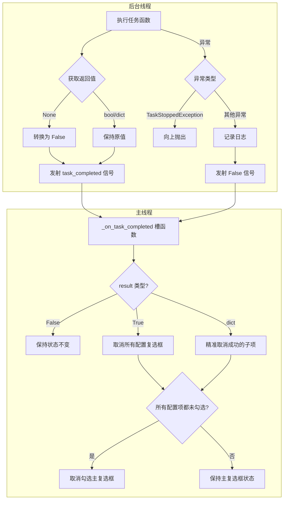

# 任务完成状态反馈机制 - 修改文档

## 一、修改背景与目的

### 1.1 背景
当前任务执行完成后，UI 无法自动反映任务执行结果。用户需要手动取消勾选已完成的任务，体验不佳。特别是在"每日可换"这类包含多个子任务的任务中，用户无法直观看到哪些子任务已完成、哪些失败。

### 1.2 目的
实现任务完成后自动更新复选框状态的机制，让用户直观看到：
- 任务成功时：自动取消勾选对应的配置复选框
- 任务失败时：保持复选框勾选状态不变
- 部分成功时：仅取消勾选成功的子项

---

## 二、具体修改内容

### 2.1 TaskConfigPanel 类扩展

**文件**: `src/ui/main_window.py`

新增 9 个方法用于配置复选框状态管理：

| 方法名 | 功能描述 |
|--------|----------|
| `has_config_checkboxes(task_name)` | 检查任务是否有配置复选框（仅检查 QCheckBox） |
| `_has_checkbox(widgets)` | 辅助方法，递归检查是否存在 QCheckBox |
| `set_all_config_checkboxes(task_name, checked)` | 批量设置配置复选框状态 |
| `set_specific_config_checkboxes(task_name, result_dict)` | 根据字典精准设置（带映射校验） |
| `_set_checkbox_by_name(widgets, checkbox_name, checked)` | 返回 bool 表示是否找到复选框 |
| `are_all_config_checkboxes_unchecked(task_name)` | 检查是否全部未勾选（复选框总数为 0 时返回 True） |
| `_are_all_unchecked(widgets)` | 辅助方法，递归检查所有 QCheckBox 是否都未勾选 |
| `get_flattened_task_params(task_name)` | 获取扁平化参数（全量提取） |
| `_flatten_params(widgets, result)` | 提取所有基础控件类型 |

### 2.2 ScriptWorker 类改造

**文件**: `src/ui/main_window.py`

#### 2.2.1 新增信号定义
```python
task_completed = pyqtSignal(str, object)  # (task_name, result: bool | dict)
```

#### 2.2.2 run() 方法改造
- 获取任务函数返回值
- 遵循悲观原则处理返回值（None -> False）
- 任务执行完成后发射 `task_completed` 信号
- 异常捕获时记录日志并发射信号

### 2.3 ClassicScriptUI 类改造

**文件**: `src/ui/main_window.py`

#### 2.3.1 新增槽函数
```python
def _on_task_completed(self, task_name: str, result):
    """
    处理任务完成信号
    
    参数：
        task_name: 任务名称
        result: True/False 或 {"子项名": True/False, ...}
    """
```

#### 2.3.2 参数传递逻辑改造
`_get_task_params_for_execution()` 方法改用 `get_flattened_task_params()` 获取扁平化参数。

### 2.4 每日可换任务函数改造

**文件**: `src/core/daily_tasks.py`

#### 2.4.1 新增常量定义
```python
EXECUTABLE_SUBTASKS = [
    "每日签到", "每日江湖礼", "每日在线礼", "每日回馈礼",
    "每日买银票", "买鸡蛋",
    "榫头卯眼", "兑换武经志", "小红花礼盒", "购买铜豆子", "功绩换铜板", "行当绝活",
    "碧铜马坯", "买吴越剑坯", "买白公鼎坯", "兑换锦芳绣", "买形影心得", "换高级萃石"
]
```

#### 2.4.2 函数改造要点
- 返回字典格式：`{"每日签到": True, "每日江湖礼": False, ...}`
- 显式排除控制异常（TaskStoppedException、ContextExpiredException）并向上抛出
- 异常时记录详细日志（`exc_info=True`）

---

## 三、修改前后对比说明

### 3.1 任务执行流程对比

```
┌─────────────────────────────────────────────────────────────────┐
│                        修改前                                    │
├─────────────────────────────────────────────────────────────────┤
│  执行任务函数 → 无返回值 → UI 状态不变                           │
│  异常捕获 → 记录日志 → 继续执行下一个任务                         │
└─────────────────────────────────────────────────────────────────┘

┌─────────────────────────────────────────────────────────────────┐
│                        修改后                                    │
├─────────────────────────────────────────────────────────────────┤
│  执行任务函数 → 获取返回值 → 发射 task_completed 信号            │
│       ↓                                                         │
│  主线程接收信号 → 根据返回值类型更新 UI                          │
│       ├── True: 取消勾选所有配置复选框                           │
│       ├── False: 保持状态不变                                    │
│       └── dict: 精准取消勾选成功的子项                           │
│       ↓                                                         │
│  检查是否所有配置项都未勾选 → 联动取消主复选框                    │
└─────────────────────────────────────────────────────────────────┘
```

### 3.2 参数传递对比

| 项目 | 修改前 | 修改后 |
|------|--------|--------|
| 参数获取方式 | 逐个调用 `get_task_param` | 批量调用 `get_flattened_task_params` |
| 数据结构 | 按字段定义顺序提取 | 扁平化字典（全量提取所有基础控件） |
| 嵌套支持 | 仅支持顶层字段 | 支持 group/row 嵌套结构扁平化 |
| 控件类型覆盖 | 隐式支持 | 显式支持 QCheckBox/QComboBox/QLineEdit/QSpinBox |

### 3.3 异常处理对比

| 异常类型 | 修改前 | 修改后 |
|----------|--------|--------|
| TaskStoppedException | 可能被静默吞噬 | 显式向上抛出，保证停止按钮正常工作 |
| ContextExpiredException | 捕获后重置状态 | 发射 False 信号后重置状态 |
| Exception | 简单记录日志 | 记录详细堆栈信息（`exc_info=True`），发射 False 信号 |

---

## 四、涉及的文件路径及变更情况

### 4.1 文件变更清单

| 文件路径 | 变更类型 | 变更内容摘要 |
|----------|----------|--------------|
| `src/ui/main_window.py` | 修改 | TaskConfigPanel 新增 9 个方法；ScriptWorker 新增信号和改造 run()；ClassicScriptUI 新增槽函数和改造参数传递 |
| `src/core/daily_tasks.py` | 修改 | 新增 EXECUTABLE_SUBTASKS 常量；改造 每日可换 函数返回字典；新增 18 个子任务处理函数 |

### 4.2 代码行数变更

| 文件 | 新增行数 | 修改行数 | 说明 |
|------|----------|----------|------|
| `main_window.py` | ~200 行 | ~50 行 | 新增方法和槽函数实现 |
| `daily_tasks.py` | ~350 行 | ~30 行 | 新增子任务处理函数 |

---

## 五、测试验证结果

### 5.1 验证结果摘要

**✅ 60/60 检查点全部通过**

### 5.2 关键测试用例

| 测试场景 | 输入 | 预期结果 | 实际结果 |
|----------|------|----------|----------|
| 任务成功返回 True | `return True` | 取消勾选所有配置复选框 | ✅ 通过 |
| 任务失败返回 False | `return False` | 保持复选框状态不变 | ✅ 通过 |
| 部分成功返回字典 | `{"签到": True, "礼盒": False}` | 仅取消勾选"签到" | ✅ 通过 |
| 无返回值（悲观原则） | `return None` | 视为失败，保持状态 | ✅ 通过 |
| 控制异常不被捕获 | `raise TaskStoppedException` | 向上抛出，停止按钮正常 | ✅ 通过 |
| 字典 Key 无法匹配 | `{"不存在": True}` | 输出警告日志 | ✅ 通过 |

### 5.3 线程安全验证

- ✅ UI 更新在主线程执行（PyQt 信号机制保证）
- ✅ 无 UI 崩溃或卡顿
- ✅ blockSignals 防止信号风暴

---

## 六、潜在影响与注意事项

### 6.1 向后兼容性

| 影响范围 | 说明 |
|----------|------|
| 现有任务函数 | 无需修改，返回 None 时自动视为失败 |
| UI 配置结构 | 无影响，扁平化提取保持兼容 |
| 信号连接 | 新增信号不影响现有信号 |

### 6.2 使用注意事项

#### 6.2.1 任务函数返回值规范
```python
# 简单任务：返回布尔值
def simple_task(hwnd):
    return True  # 或 False

# 复杂任务：返回字典
def complex_task(hwnd, checkbox_state=None):
    return {"子项1": True, "子项2": False}
```

#### 6.2.2 控制异常处理
```python
# 正确做法：显式排除控制异常
try:
    result = do_something()
except TaskStoppedException:
    raise  # 必须向上抛出
except Exception as e:
    logger.error(f"执行异常: {e}", exc_info=True)
    return False
```

#### 6.2.3 控件命名唯一性
- 同一任务的配置数据中，所有基础控件的 `name` 属性必须全局唯一
- 不允许跨分组（Group）存在同名控件

### 6.3 性能影响

| 影响项 | 说明 |
|--------|------|
| 参数扁平化 | 每次任务执行前进行，开销可忽略 |
| 信号发射 | PyQt 信号机制高效，无性能问题 |
| blockSignals | 避免信号风暴，提升性能 |

### 6.4 后续优化建议

1. **子任务实现**：当前 `每日可换` 的 18 个子任务处理函数为占位实现，需后续补充具体逻辑
2. **其他任务改造**：可将相同机制应用到其他复杂任务
3. **配置持久化**：可考虑将任务执行结果持久化到配置文件

---

## 七、架构流程图



---

## 八、核心设计原则

### 8.1 悲观原则
- 无返回值或返回 `None` 时视为失败
- 避免半路崩溃的任务被误标记为成功

### 8.2 字典化状态传递
- 任务函数可返回字典精准控制每个子项复选框
- 格式：`{"子项名": True/False, ...}`

### 8.3 面板级信号保护
- 在面板级别统一开启信号屏蔽（TaskConfigPanel + TaskListPanel）
- 使用 `try-finally` 确保信号屏蔽被恢复
- 避免触发自动保存等副作用

### 8.4 线程安全
- 通过 PyQt 信号机制在主线程更新 UI
- 禁止后台线程直接操作 UI 控件

### 8.5 映射校验机制
- 字典 Key 无法匹配时输出 `logger.warning` 警告日志
- 避免 Bug 被长期静默掩盖

### 8.6 禁止捕获控制异常
- 显式排除 `TaskStoppedException`、`ContextExpiredException` 并向上抛出
- 保证停止/暂停按钮正常工作

---

**文档版本**: v1.0  
**创建日期**: 2026-03-06  
**相关 Spec**: `.trae/specs/task-completion-feedback/spec.md`
