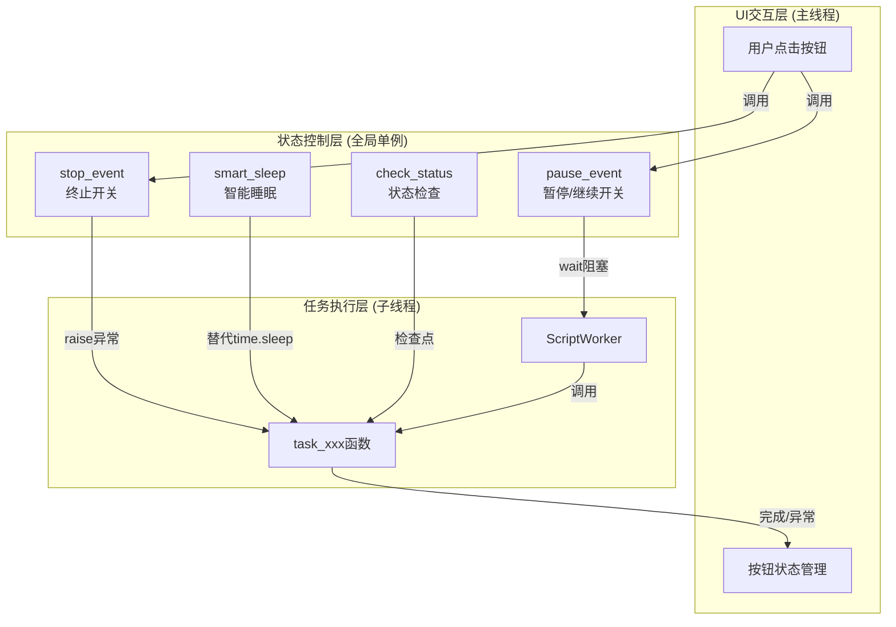
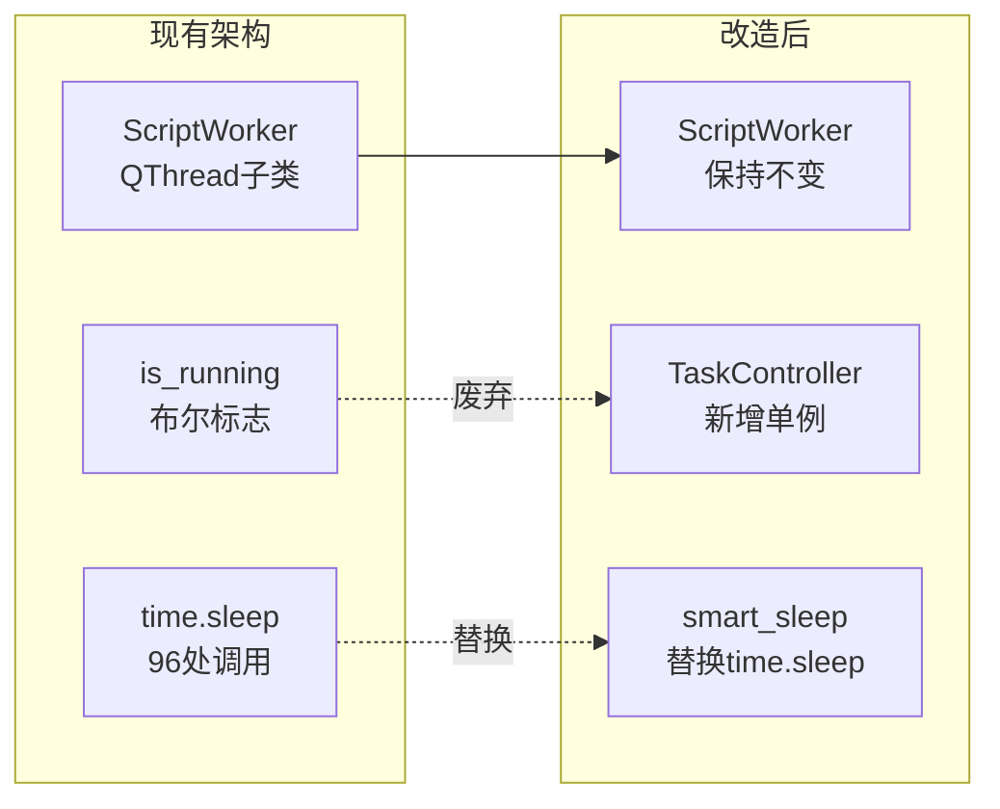
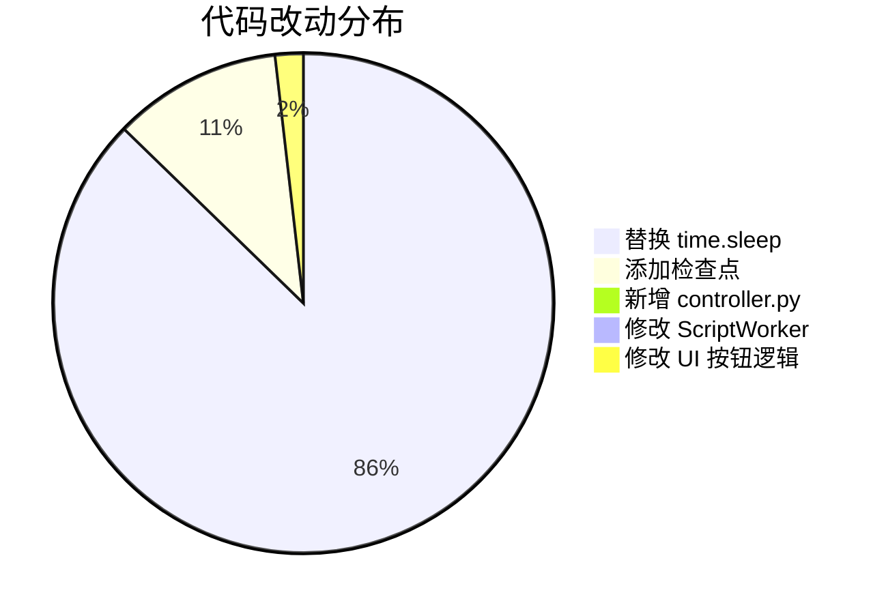
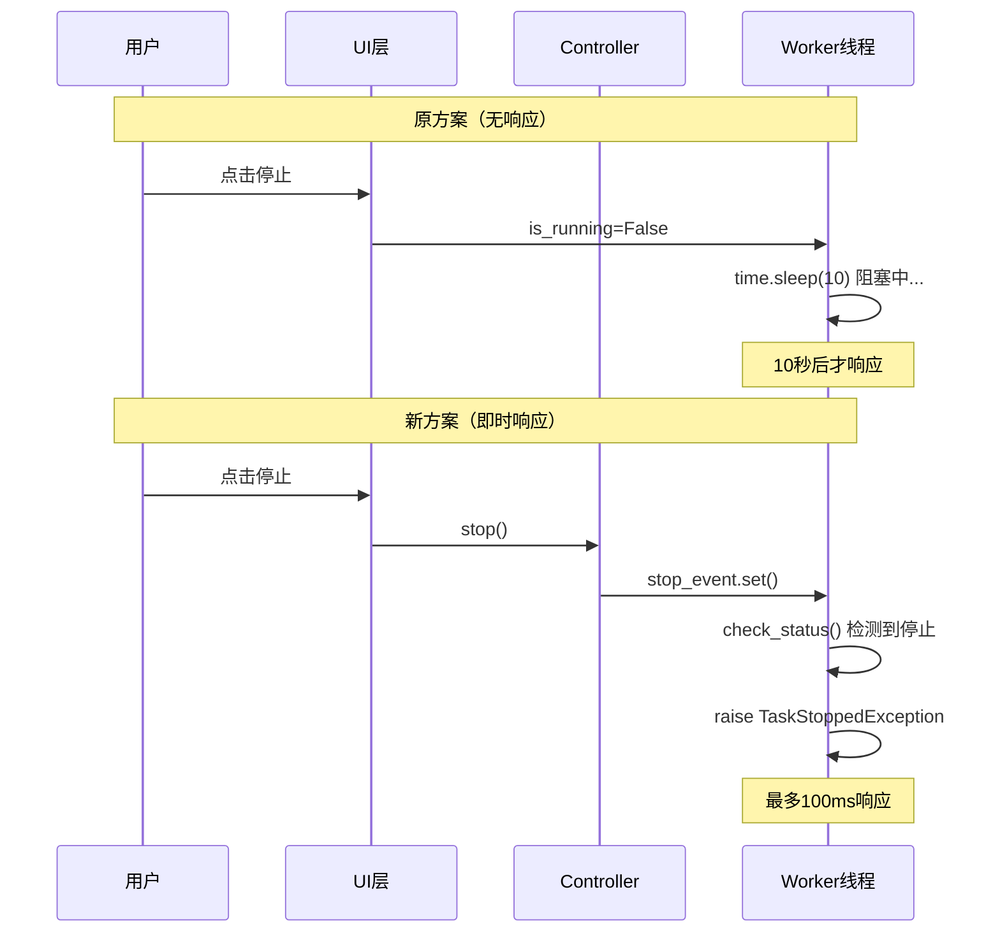
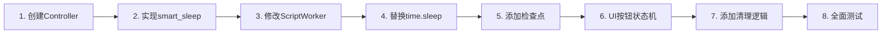

# 任务控制方案可行性分析报告

> 本文档对 `任务控制方案.md` 中提出的多线程自动化脚本状态控制方案进行全面可行性评估。

---

## 📊 一、方案概述

该方案提出了一种**三层分离架构**来实现多线程自动化脚本的暂停、继续和强制停止功能：



---

## ✅ 二、技术可行性评估

### 2.1 核心技术点分析

| 技术点 | 可行性 | 说明 |
|--------|--------|------|
| `threading.Event` | ✅ 完全可行 | Python 标准库，线程安全，成熟稳定 |
| 异常传播机制 | ✅ 完全可行 | Python 原生支持异常跨函数传播 |
| `QThread` 集成 | ✅ 完全可行 | PyQt5 与 `threading.Event` 兼容良好 |
| 信号槽通信 | ✅ 完全可行 | 已有 `pyqtSignal` 基础设施 |

### 2.2 与现有代码的兼容性



**兼容性评估**：

- ✅ `ScriptWorker` 类结构无需大改，只需在 `run()` 外层添加 try-except
- ✅ 现有信号机制 (`finished_sig`, `log_out`) 可继续使用
- ⚠️ 需要修改 96 处 `time.sleep()` 调用
- ⚠️ 需要在 12 个 `while` 循环中添加检查点

---

## 📈 三、资源需求评估

### 3.1 开发工作量估算

| 任务项 | 工作量 | 风险等级 | 说明 |
|--------|--------|----------|------|
| 创建 `controller.py` | 低 | 🟢 低 | 约 100-150 行代码 |
| 实现 `smart_sleep` | 低 | 🟢 低 | 约 20 行代码 |
| 替换 `time.sleep` | 中 | 🟡 中 | 96 处替换，需逐个确认 |
| 添加检查点 | 中 | 🟡 中 | 12 个循环，需分析逻辑 |
| 修改 `ScriptWorker.run` | 低 | 🟢 低 | 添加 try-except 块 |
| UI 按钮状态机 | 中 | 🟡 中 | 需要仔细处理状态转换 |
| 测试验证 | 高 | 🔴 高 | 需覆盖所有任务场景 |

### 3.2 代码改动范围



---

## ⚠️ 四、潜在风险分析

### 4.1 高风险点

#### 风险1：异常传播可能破坏游戏状态

```python
# 问题场景
def task_xxx(hwnd):
    background_click(hwnd, 100, 200)  # 点击了某个按钮
    time.sleep(2)                      # 等待动画
    # 如果在这里触发 TaskStoppedException
    # 游戏界面可能停留在中间状态
    background_click(hwnd, 300, 400)  # 这行不会执行
```

**影响**：强制停止时，游戏可能处于不可预期的状态（如对话框未关闭、界面未返回）

**缓解措施**：
- 在 `except TaskStoppedException` 块中添加清理逻辑
- 实现状态恢复函数，将游戏切回主界面

#### 风险2：`smart_sleep` 精度问题

```python
# 方案中的实现
def smart_sleep(seconds):
    end_time = time.time() + seconds
    while time.time() < end_time:
        check_status()
        time.sleep(0.1)  # 100ms 粒度
```

**问题**：
- 实际睡眠时间可能比预期多出 0-100ms
- 对于需要精确时序的操作可能有影响

**缓解措施**：
- 对于精确度要求高的场景，保留原生 `time.sleep` 但添加注释说明
- 或提供 `smart_sleep_precise()` 变体

### 4.2 中风险点

#### 风险3：嵌套调用中的状态检查遗漏

```python
def task_A(hwnd):
    helper_function(hwnd)  # 内部可能有长时间操作
    # 如果 helper_function 内部没有检查点，仍会阻塞

def helper_function(hwnd):
    time.sleep(10)  # 这个 sleep 可能被遗漏替换
```

**缓解措施**：
- 使用全局搜索确保所有 `time.sleep` 都被替换
- 代码审查时重点检查辅助函数

#### 风险4：暂停状态下的资源占用

```python
# 暂停时线程处于 wait() 状态
# 虽然不消耗 CPU，但线程资源仍被占用
pause_event.wait()  # 无限等待
```

**影响**：长时间暂停可能导致线程资源未释放

**缓解措施**：
- 添加暂停超时机制（可选）
- UI 提示用户长时间暂停的影响

---

## 💪 五、方案优势分析

### 5.1 架构优势

| 优势 | 说明 |
|------|------|
| **响应即时性** | 最多 100ms 延迟即可响应暂停/停止 |
| **CPU 友好** | 暂停时使用 `Event.wait()`，CPU 占用接近 0% |
| **代码解耦** | UI、控制、执行三层分离，职责清晰 |
| **可扩展性** | 新增任务只需遵循检查点规范 |
| **异常安全** | 异常传播机制确保资源可被清理 |

### 5.2 用户体验提升



---

## 🔧 六、方案不足与改进建议

### 6.1 不足之处

| 不足 | 影响 | 严重程度 |
|------|------|----------|
| 需要大量替换现有代码 | 维护成本高 | 🟡 中 |
| 缺乏状态恢复机制 | 游戏可能处于中间状态 | 🔴 高 |
| 无暂停超时保护 | 资源长期占用 | 🟡 中 |
| 缺少任务进度保存 | 无法从断点继续 | 🟢 低 |

### 6.2 改进建议

#### 建议1：增加状态恢复机制

```python
class TaskController:
    def __init__(self):
        self._cleanup_handlers = []  # 清理处理器列表
    
    def register_cleanup(self, handler):
        """注册清理函数"""
        self._cleanup_handlers.append(handler)
    
    def perform_cleanup(self):
        """执行所有清理操作"""
        for handler in self._cleanup_handlers:
            try:
                handler()
            except Exception:
                pass
```

#### 建议2：添加暂停超时机制

```python
def check_status(self, timeout=None):
    """带超时的状态检查"""
    if self._stop_event.is_set():
        raise TaskStoppedException()
    
    if timeout:
        # 带超时的等待，避免无限阻塞
        if not self._pause_event.wait(timeout=timeout):
            self.logger.warning(f"暂停超时({timeout}秒)，自动继续")
    else:
        self._pause_event.wait()
```

#### 建议3：引入任务状态快照（可选高级功能）

```python
class TaskSnapshot:
    """任务状态快照，支持断点续执行"""
    def __init__(self):
        self.current_task = None
        self.task_progress = {}
        self.game_state = None
    
    def save(self, task_name, progress):
        self.current_task = task_name
        self.task_progress[task_name] = progress
```

---

## 📋 七、替代方案对比

### 7.1 替代方案：进程级控制

```python
import multiprocessing

# 使用进程而非线程
process = multiprocessing.Process(target=task_function)
process.start()
process.terminate()  # 强制终止，无需代码配合
```

| 对比项 | 线程+Event方案 | 进程方案 |
|--------|---------------|----------|
| 响应速度 | 快（100ms内） | 即时 |
| 实现复杂度 | 中等 | 低 |
| 资源开销 | 低 | 高 |
| 状态恢复 | 可控 | 不可控 |
| 适用场景 | 需要优雅停止 | 无需状态恢复 |

**结论**：对于游戏自动化场景，线程+Event 方案更合适，因为需要执行清理操作。

### 7.2 替代方案：协程异步

```python
import asyncio

async def smart_sleep(seconds):
    for _ in range(int(seconds * 10)):
        check_status()
        await asyncio.sleep(0.1)
```

| 对比项 | 线程+Event方案 | 协程方案 |
|--------|---------------|----------|
| 改动量 | 中等 | 大（需重构为异步） |
| PyQt兼容 | ✅ 好 | ⚠️ 需要适配 |
| 性能 | 良好 | 更好 |
| 学习成本 | 低 | 高 |

**结论**：现有 PyQt 架构下，线程方案更务实。

---

## 📝 八、实施建议清单

### 8.1 推荐实施步骤



### 8.2 详细 Checklist

| 序号 | 任务 | 优先级 | 预估时间 |
|------|------|--------|----------|
| 1 | 创建 `src/core/controller.py`，实现 `TaskController` 类 | P0 | 1小时 |
| 2 | 实现 `smart_sleep()` 和 `check_status()` | P0 | 0.5小时 |
| 3 | 定义 `TaskStoppedException` 异常 | P0 | 5分钟 |
| 4 | 修改 `ScriptWorker.run()` 添加 try-except | P0 | 0.5小时 |
| 5 | 批量替换 `daily_tasks.py` 中的 `time.sleep` | P1 | 2小时 |
| 6 | 在 `while` 循环中添加 `check_status()` | P1 | 1小时 |
| 7 | 修改 UI 按钮逻辑，实现状态机 | P1 | 1.5小时 |
| 8 | 实现游戏状态恢复函数 | P2 | 1小时 |
| 9 | 编写单元测试 | P2 | 2小时 |
| 10 | 集成测试与调试 | P1 | 3小时 |

**总预估工作量**：约 12-15 小时

---

## 🎯 九、结论

### 总体评估

| 维度 | 评分 | 说明 |
|------|------|------|
| **技术可行性** | ⭐⭐⭐⭐⭐ | 基于成熟技术，无技术障碍 |
| **实现复杂度** | ⭐⭐⭐☆☆ | 需要大量代码替换，但逻辑简单 |
| **风险可控性** | ⭐⭐⭐☆☆ | 主要风险可通过清理机制缓解 |
| **收益/成本比** | ⭐⭐⭐⭐☆ | 显著提升用户体验，值得投入 |

### 最终建议

**✅ 推荐实施该方案**，理由如下：

1. **解决核心痛点**：彻底解决任务无法即时响应暂停/停止的问题
2. **架构升级**：三层分离设计符合软件工程最佳实践
3. **可维护性提升**：控制逻辑集中管理，便于后续扩展
4. **工作量可控**：约 12-15 小时，属于中等规模重构

### 实施优先级建议

1. **第一阶段（核心功能）**：实现 Controller、smart_sleep、修改 ScriptWorker
2. **第二阶段（全面替换）**：替换所有 time.sleep、添加检查点
3. **第三阶段（完善体验）**：添加状态恢复、UI 状态机优化

---

## 📎 附录：现有代码统计

### A. time.sleep 调用统计

| 文件 | 调用次数 | 说明 |
|------|----------|------|
| `src/core/daily_tasks.py` | 96 | 主要任务逻辑文件 |
| `src/core/helpers.py` | 待统计 | 辅助函数文件 |

### B. 循环结构统计

| 类型 | 数量 | 需添加检查点 |
|------|------|--------------|
| `while` 循环 | 12 | ✅ 是 |
| `for` 循环 | 5 | ⚠️ 视情况 |

### C. 相关文件路径

| 文件 | 路径 | 说明 |
|------|------|------|
| 主窗口 | `src/ui/main_window.py` | 包含 ScriptWorker 和 ClassicScriptUI |
| 日常任务 | `src/core/daily_tasks.py` | 包含所有 task_xxx 函数 |
| 辅助函数 | `src/core/helpers.py` | 包含 win_gb、zhd 等辅助函数 |
| 配置文件 | `src/config/settings.py` | 全局配置类 |
