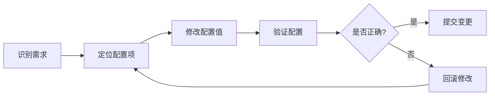
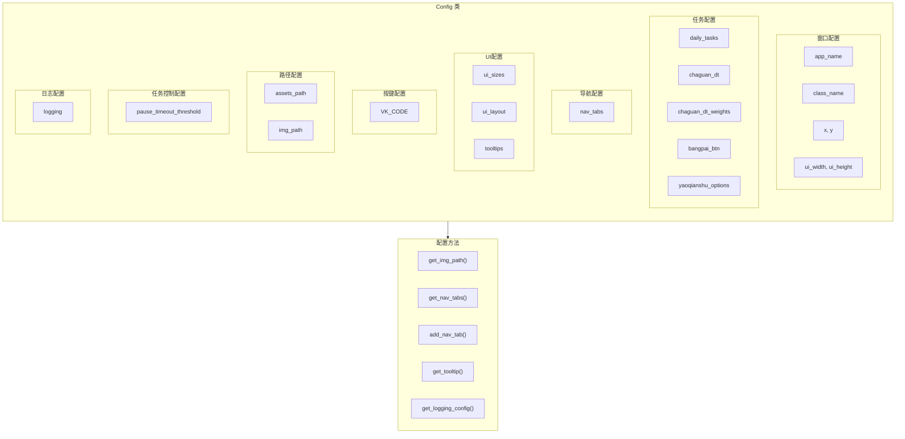

# 配置文件使用文档

## 1. 概述

### 1.1 文件位置

```
src/config/settings.py
```

### 1.2 目的

`settings.py` 是游戏辅助工具的全局配置管理模块，采用单例模式设计，集中管理所有配置参数。主要功能包括：

- **窗口配置**：目标游戏窗口和UI窗口的尺寸参数
- **任务配置**：日常任务列表、答题坐标、按钮坐标等
- **导航配置**：顶部导航栏选项卡配置
- **UI配置**：界面控件尺寸和布局参数
- **按键映射**：常用按键的VK码映射
- **路径配置**：资源文件路径管理
- **日志配置**：日志输出方式和级别配置

### 1.3 使用方式

```python
from src.config import config

# 访问配置值
window_width = config.ui_width
button_size = config.ui_sizes["pick_btn"]

# 调用配置方法
img_path = config.get_img_path("richang_/mryg.png")
nav_tabs = config.get_nav_tabs()
```

---

## 2. 配置参数详解

### 2.1 窗口配置 (Window Config)

| 参数名 | 数据类型 | 默认值 | 说明 |
|--------|----------|--------|------|
| `app_name` | str | `'糊批解放器'` | 应用程序名称，用于窗口标题 |
| `class_name` | str | `'Messiah_Game'` | 目标游戏窗口的类名，用于窗口查找 |
| `x` | int | `960` | 游戏窗口宽度（像素） |
| `y` | int | `540` | 游戏窗口高度（像素） |
| `ui_width` | int | `900` | UI窗口宽度（像素） |
| `ui_height` | int | `540` | UI窗口高度（像素） |

**使用场景**：
- `app_name`：主窗口标题和关于对话框
- `class_name`：窗口选择器查找目标游戏窗口
- `x`, `y`：验证游戏窗口分辨率是否匹配
- `ui_width`, `ui_height`：设置主窗口固定尺寸

**代码示例**：
```python
# 设置窗口标题
self.setWindowTitle(config.app_name)

# 窗口选择器使用
self.target_class_name = config.class_name
self.target_width = config.x
self.target_height = config.y

# 主窗口尺寸设置
self.setFixedSize(config.ui_width, config.ui_height)
```

---

### 2.2 任务配置 (Task Config)

#### 2.2.1 日常任务列表

| 参数名 | 数据类型 | 默认值 | 说明 |
|--------|----------|--------|------|
| `daily_tasks` | list[str/list] | 见下方 | 日常任务名称列表，支持任务组 |

**数据结构**：
- `str`: 单个任务，垂直排列显示
- `list[str]`: 任务组，水平排列显示

**默认值**：
```python
["山河器", "摇钱树", "茶馆说书", "每日兑换", "每日一卦", "课业任务", "帮派任务",
 "门客设宴", "破阵设宴", ["华山论剑1v1", "江湖英雄榜"], "每日副本", "聚义平冤", "江湖行商"]
```

**任务组示例**：
```python
# 单个任务 - 垂直排列
"摇钱树"

# 任务组 - 水平排列
["华山论剑1v1", "江湖英雄榜"]
```

**使用场景**：生成日常任务复选框列表和任务配置面板

#### 2.2.2 茶馆答题配置

| 参数名 | 数据类型 | 默认值 | 说明 |
|--------|----------|--------|------|
| `chaguan_dt` | list[tuple] | `[(908, 248), (908, 314), (908, 377), (908, 439)]` | 答题选项点击坐标 |
| `chaguan_dt_weights` | list[float] | `[0.35, 0.35, 0.2, 0.1]` | 答题选项选择权重 |

**使用场景**：茶馆说书任务随机选择答案

**代码示例**：
```python
import random

# 按权重随机选择答案
pos_DaTi = random.choices(config.chaguan_dt, weights=config.chaguan_dt_weights, k=1)[0]
```

#### 2.2.3 帮派按钮配置

| 参数名 | 数据类型 | 默认值 | 说明 |
|--------|----------|--------|------|
| `bangpai_btn` | tuple | `(235, 469)` | 帮派按钮点击坐标 |

**使用场景**：帮派任务点击帮派按钮

#### 2.2.4 摇钱树选项配置

| 参数名 | 数据类型 | 默认值 | 说明 |
|--------|----------|--------|------|
| `yaoqianshu_options` | dict | 见下方 | 摇钱树选项配置 |

**默认值**：
```python
{
    0: {"name": "用力摇", "coord": (620, 301)},
    1: {"name": "轻轻摇", "coord": (633, 258)},
    2: {"name": "全力", "coord": (659, 208)}
}
```

**使用场景**：摇钱树任务选择不同摇动方式

#### 2.2.5 任务配置定义

| 参数名 | 数据类型 | 说明 |
|--------|----------|------|
| `task_config_definitions` | dict | 定义哪些任务有配置项及其配置字段 |

**配置结构**：
```python
task_config_definitions = {
    "摇钱树": {
        "fields": [
            {
                "name": "choice",           # 参数名称
                "type": "dropdown",          # 字段类型
                "label": "摇树方式",         # 显示标签
                "options": ["轻轻摇", "用力摇", "全力摇"],  # 下拉选项
                "default": "轻轻摇",         # 默认值
                "value_map": {               # 值映射（UI值 -> 执行参数）
                    "轻轻摇": 1,
                    "用力摇": 0,
                    "全力摇": 2
                }
            }
        ]
    },
}
```

**字段类型**：
| 类型 | 控件 | 必填字段 | 适用场景 |
|------|------|----------|----------|
| `dropdown` | 下拉选择框 | `options`, `default`, `value_map` | 固定选项选择 |
| `text` | 文本输入框 | `default` | 自由文本输入 |
| `number` | 数字微调框 | `default`，可选 `min`, `max`, `step` | 数值输入 |
| `checkbox` | 复选框 | `default` (True/False) | 开关选项 |

**使用场景**：定义任务的详细配置项，自动生成配置界面

**添加新任务配置示例**：

```python
# 在 settings.py 的 _init_task_config_definitions 中添加

# 示例1: 下拉选择框
self.task_config_definitions["摇钱树"] = {
    "fields": [
        {
            "name": "choice",
            "type": "dropdown",
            "label": "摇树方式",
            "options": ["轻轻摇", "用力摇", "全力摇"],
            "default": "轻轻摇",
            "value_map": {
                "轻轻摇": 1,
                "用力摇": 0,
                "全力摇": 2
            }
        }
    ]
}

# 示例2: 文本输入框
self.task_config_definitions["自定义任务"] = {
    "fields": [
        {
            "name": "username",
            "type": "text",
            "label": "用户名",
            "default": "",
            "placeholder": "请输入用户名"
        }
    ]
}

# 示例3: 数字微调框
self.task_config_definitions["循环任务"] = {
    "fields": [
        {
            "name": "count",
            "type": "number",
            "label": "循环次数",
            "default": 5,
            "min": 1,
            "max": 100,
            "step": 1
        }
    ]
}

# 示例4: 复选框
self.task_config_definitions["高级任务"] = {
    "fields": [
        {
            "name": "auto_confirm",
            "type": "checkbox",
            "label": "自动确认",
            "default": True
        }
    ]
}

# 示例5: 多参数配置
self.task_config_definitions["复杂任务"] = {
    "fields": [
        {
            "name": "mode",
            "type": "dropdown",
            "label": "执行模式",
            "options": ["快速", "标准", "深度"],
            "default": "标准",
            "value_map": {"快速": 1, "标准": 2, "深度": 3}
        },
        {
            "name": "retry_count",
            "type": "number",
            "label": "重试次数",
            "default": 3,
            "min": 0,
            "max": 10
        },
        {
            "name": "auto_save",
            "type": "checkbox",
            "label": "自动保存",
            "default": True
        }
    ]
}

# 示例6: 静态标签
self.task_config_definitions["信息展示"] = {
    "fields": [
        {
            "name": "status_label",
            "type": "label",
            "text": "当前状态: 已连接",
            "style": "success"  # 可选: normal, info, warning, success, danger
        }
    ]
}

# 示例7: 行内布局
self.task_config_definitions["行内配置"] = {
    "fields": [
        {
            "name": "row1",
            "type": "row",
            "layout_align": "left",  # 可选: left (默认), fill
            "items": [
                {"name": "auto_save", "type": "checkbox", "label": "", "default": True},
                {"name": "save_label", "type": "label", "text": "自动保存已启用"}
            ]
        }
    ]
}

# 示例8: 分组容器
self.task_config_definitions["分组配置"] = {
    "fields": [
        {
            "name": "basic_settings",
            "type": "group",
            "label": "基础设置",
            "fields": [
                {
                    "name": "row1",
                    "type": "row",
                    "items": [
                        {"name": "mode", "type": "dropdown", "label": "执行模式", 
                         "options": ["快速", "标准"], "default": "标准"},
                        {"name": "retry", "type": "number", "label": "重试次数", 
                         "default": 3, "min": 1, "max": 10}
                    ]
                }
            ]
        }
    ]
}
```

**注意事项**：
- `dropdown` 类型必须提供 `options` 和 `value_map`
- `number` 类型的 `min`、`max`、`step` 为可选参数
- `checkbox` 的 `default` 值为布尔类型

**嵌套约束**：
- `row` 内部仅允许基础控件（dropdown, text, number, checkbox, spinbox）或 `label`，禁止嵌套 `row` 或 `group`
- `group` 内部允许基础控件、`label` 和 `row`，禁止嵌套子 `group`

#### 2.2.5.1 共享配置（配置继承）

多个任务可以共享同一个配置区域，避免重复定义相同的配置项。

**使用场景**：
- 多个任务使用相同的配置参数（如组队方式、人数等）
- 减少配置冗余，统一管理共享配置

**配置方式**：

```python
# 定义共享配置（使用 is_shared 标记）
self.definitions["组队配置"] = {
    "is_shared": True,  # 标记为共享配置
    "section_width": 400,
    "fields": [
        {
            "name": "mode_row",
            "type": "row",
            "items": [
                {
                    "name": "team_mode",
                    "type": "dropdown",
                    "label": "组队方式",
                    "options": ["队长组队", "队员混队"],
                    "default": "队长组队",
                    "value_map": {"队长组队": "leader", "队员混队": "member"}
                },
                {
                    "name": "team_size",
                    "type": "dropdown",
                    "label": "组队人数",
                    "options": ["1人", "2人", "3人", "4人", "5人"],
                    "default": "3人",
                    "value_map": {"1人": 1, "2人": 2, "3人": 3, "4人": 4, "5人": 5}
                }
            ]
        }
    ]
}

# 任务继承共享配置（使用 extends 引用）
self.definitions["日常副本"] = {"extends": "组队配置"}
self.definitions["每日悬赏"] = {"extends": "组队配置"}
```

**效果说明**：

```
┌─────────────────────────────────────────────────────────────┐
│  左侧任务列表                                                │
│  ┌─────────────────────────────────────────────────────────┐│
│  │ [✓] 日常副本                                            ││
│  │ [✓] 每日悬赏                                            ││
│  │ ...                                                     ││
│  └─────────────────────────────────────────────────────────┘│
└─────────────────────────────────────────────────────────────┘
                           │
                           │ 点击任一任务
                           ▼
┌─────────────────────────────────────────────────────────────┐
│  右侧配置区域                                                │
│  ┌─────────────────────────────────────────────────────────┐│
│  │ 【组队配置】                                             ││
│  │ 组队方式: [队长组队 ▼]  组队人数: [3人 ▼]               ││
│  └─────────────────────────────────────────────────────────┘│
└─────────────────────────────────────────────────────────────┘
```

**相关方法**：

| 方法名 | 参数 | 返回值 | 说明 |
|--------|------|--------|------|
| `get_shared_config_name(task_name)` | str | Optional[str] | 获取任务继承的共享配置名 |
| `is_shared_config(config_name)` | str | bool | 检查配置名是否为共享配置 |

**代码示例**：

```python
from src.config import config

# 检查任务是否继承共享配置
shared_name = config.task_definition.get_shared_config_name("日常副本")
# 返回: "组队配置"

# 检查配置是否为共享配置
is_shared = config.task_definition.is_shared_config("组队配置")
# 返回: True
```

#### 2.2.6 用户配置方案

| 参数名 | 数据类型 | 说明 |
|--------|----------|------|
| `saved_configs` | dict | 用户保存的配置方案 |
| `current_config_name` | str | 当前使用的配置名称 |
| `user_config_path` | Path | 用户配置文件路径 |

**配置方案结构**：
```python
{
    "配置名称": {
        "last_used": "2026-03-02T10:00:00",  # 最后使用时间
        "checked_tasks": ["摇钱树", "茶馆说书"],  # 勾选的任务
        "task_params": {                      # 任务参数
            "摇钱树": {"choice": "轻轻摇"}
        }
    }
}
```

**配置方案存储位置**：`config/user_task_configs.json`

---

### 2.3 导航配置 (Nav Config)

| 参数名 | 数据类型 | 默认值 | 说明 |
|--------|----------|--------|------|
| `nav_tabs` | list[dict] | 见下方 | 导航选项卡配置列表 |

**默认值**：
```python
[
    {"name": "日常任务", "key": "daily", "icon": None},
    {"name": "副本任务", "key": "dungeon", "icon": None},
    {"name": "挂机任务", "key": "afk", "icon": None},
    {"name": "其他功能", "key": "other", "icon": None},
]
```

**字段说明**：
- `name`：选项卡显示名称
- `key`：选项卡唯一标识
- `icon`：选项卡图标路径（可选）

**动态添加选项卡**：
```python
config.add_nav_tab("新功能", "new_feature")
```

---

### 2.4 UI配置 (UI Config)

#### 2.4.1 控件尺寸配置 (`ui_sizes`)

| 参数名 | 数据类型 | 默认值 | 说明 |
|--------|----------|--------|------|
| `pick_btn` | tuple[int, int] | `(30, 30)` | 瞄准镜按钮尺寸 (宽×高) |
| `unbind_btn` | tuple[int, int] | `(30, 30)` | 解绑按钮尺寸 (宽×高) |
| `hwnd_label` | tuple[int, int] | `(90, 30)` | 句柄显示区域尺寸 |
| `preview_label` | tuple[int, int] | `(90, 30)` | 区域预览标签尺寸 |
| `start_btn` | tuple[int, int] | `(85, 30)` | 开始执行按钮尺寸 |
| `stop_btn` | tuple[int, int] | `(85, 30)` | 暂停运行按钮尺寸 |
| `nav_height` | int | `36` | 导航栏高度 |
| `tab_height` | int | `30` | 选项卡按钮高度 |
| `tab_min_width` | int | `80` | 选项卡最小宽度 |
| `left_ctrl_width` | int | `240` | 左侧控制区固定宽度 |
| `log_width` | int | `350` | 日志区域固定宽度 |

**使用示例**：
```python
# 设置按钮尺寸
btn_size = config.ui_sizes["pick_btn"]
self.pick_btn.setFixedSize(*btn_size)

# 设置导航栏高度
self.setFixedHeight(config.ui_sizes["nav_height"])
```

#### 2.4.2 布局参数配置 (`ui_layout`)

**左侧布局参数 (`left`)**：

| 参数名 | 数据类型 | 默认值 | 说明 |
|--------|----------|--------|------|
| `margin` | tuple[int, int, int, int] | `(10, 8, 10, 8)` | 外边距 (左, 上, 右, 下) |
| `h_spacing` | int | `10` | 水平间距 |
| `v_spacing` | int | `10` | 垂直间距 |
| `row_height` | int | `30` | 每行最小高度 |
| `row_count` | int | `3` | 行数 |

**中间控制区参数 (`middle`)**：

| 参数名 | 数据类型 | 默认值 | 说明 |
|--------|----------|--------|------|
| `margin` | tuple[int, int, int, int] | `(0, 0, 0, 0)` | 外边距 |
| `min_width` | int | `0` | 最小宽度（预留） |

**右侧日志区参数 (`right`)**：

| 参数名 | 数据类型 | 默认值 | 说明 |
|--------|----------|--------|------|
| `margin` | tuple[int, int, int, int] | `(4, 0, 4, 0)` | 外边距 |

**其他布局参数**：

| 参数名 | 数据类型 | 默认值 | 说明 |
|--------|----------|--------|------|
| `bottom_group_height` | int | `140` | 底部运行控制区高度 |
| `bottom_spacing` | int | `8` | 底部各区域间距 |

**使用示例**：
```python
# 设置布局边距
left_margin = config.ui_layout["left"]["margin"]
left_layout.setContentsMargins(*left_margin)

# 设置行列
row_count = config.ui_layout["left"]["row_count"]
for i in range(row_count):
    left_layout.setRowMinimumHeight(i, row_height)
```

#### 2.4.3 提示文本配置 (`tooltips`)

| 参数名 | 数据类型 | 默认值 | 说明 |
|--------|----------|--------|------|
| `pick_idle` | str | `"长按拖动到游戏窗口释放"` | 瞄准镜按钮空闲状态提示 |
| `pick_bound` | str | `"已绑定窗口，点击解绑后可重新选择"` | 瞄准镜按钮已绑定状态提示 |
| `pick_dragging` | str | `"拖动到目标窗口后释放"` | 瞄准镜按钮拖动状态提示 |
| `unbind_disabled` | str | `"未绑定窗口，无法解绑"` | 解绑按钮禁用状态提示 |
| `unbind_enabled` | str | `"点击解绑已绑定的窗口"` | 解绑按钮启用状态提示 |

**使用示例**：
```python
tooltip = config.get_tooltip("pick_idle")
self.setToolTip(tooltip)
```

---

### 2.5 按键映射配置 (Key Config)

| 参数名 | 数据类型 | 说明 |
|--------|----------|------|
| `VK_CODE` | dict[str, int] | 按键名称到VK码的映射 |

**支持的按键**：
- 功能键：`ESC`, `ENTER`, `TAB`, `SPACE`, `BACKSPACE`
- 修饰键：`SHIFT`, `CTRL`, `ALT`
- 方向键：`UP`, `DOWN`, `LEFT`, `RIGHT`
- F键：`F1` - `F12`

**使用示例**：
```python
from src.utils.win_api import press_key

# 按下ESC键
press_key(hwnd, config.VK_CODE["ESC"])
```

---

### 2.6 路径配置 (Path Config)

| 参数名 | 数据类型 | 说明 |
|--------|----------|------|
| `base_path` | Path | 只读资源基础路径（图片等静态资源） |
| `data_path` | Path | 可读写数据基础路径（日志、配置文件） |
| `assets_path` | Path | 资源文件根路径 |
| `img_path` | Path | 图片资源路径 |

**路径分离说明**：

在 PyInstaller 打包环境下，路径分为两类：

| 路径类型 | 打包环境 | 开发环境 | 用途 |
|----------|----------|----------|------|
| `base_path` | `sys._MEIPASS`（临时目录） | 项目根目录 | 只读资源（图片） |
| `data_path` | `sys.executable.parent`（exe所在目录） | 项目根目录 | 可读写数据（日志、配置） |

**方法**：

| 方法名 | 参数 | 返回值 | 说明 |
|--------|------|--------|------|
| `get_img_path(relative_path)` | str | str | 获取图片绝对路径 |
| `get_config_path(filename)` | str | str | 获取配置文件绝对路径 |
| `get_log_path(filename)` | str | str | 获取日志文件绝对路径 |

**使用示例**：
```python
# 获取图片路径（只读资源）
img_path = config.get_img_path("richang_/mryg.png")
pos = find_image(hwnd, img_path, threshold=0.8)

# 获取配置文件路径（可读写）
config_file = config.get_config_path("user_settings.json")

# 获取日志文件路径（可读写）
log_file = config.get_log_path("app.log")
```

---

### 2.7 任务控制配置 (Task Control Config)

| 参数名 | 数据类型 | 默认值 | 说明 |
|--------|----------|--------|------|
| `pause_timeout_threshold` | int | `300` | 暂停超时阈值（秒），默认5分钟 |

**使用场景**：
- 当任务暂停时间超过此阈值时，恢复执行会抛出 `ContextExpiredException`
- 防止长时间暂停后游戏状态变化导致任务执行异常

**代码示例**：
```python
from src.config import config

# 获取暂停超时阈值
timeout = config.pause_timeout_threshold  # 默认 300 秒（5分钟）

# 在 TaskController 中使用
# 如果暂停超过 300 秒，resume() 会抛出 ContextExpiredException
```

**自定义超时**：
```python
from src.core import task_controller

# 方式1: 使用全局默认超时阈值
task_controller.pause()  # 使用 config.pause_timeout_threshold

# 方式2: 任务自定义超时阈值（优先级更高）
task_controller.pause(timeout=60)  # 自定义 60 秒超时
```

---

### 2.8 日志配置 (Logging Config)

| 参数名 | 数据类型 | 默认值 | 说明 |
|--------|----------|--------|------|
| `logging.console.enabled` | bool | `True` | 是否启用控制台输出 |
| `logging.console.level` | str | `'DEBUG'` | 控制台日志级别 |
| `logging.console.use_color` | bool | `True` | 是否使用彩色输出 |
| `logging.file.enabled` | bool | `True` | 是否启用文件输出 |
| `logging.file.level` | str | `'DEBUG'` | 文件日志级别 |
| `logging.file.path` | str | `logs/app.log` | 日志文件路径 |
| `logging.file.max_size` | int | `10485760` | 单文件最大大小 (10MB) |
| `logging.file.backup_count` | int | `5` | 备份文件数量 |
| `logging.signal.enabled` | bool | `True` | 是否启用信号输出 |
| `logging.signal.level` | str | `'INFO'` | 信号日志级别 |

**日志级别**：`DEBUG` < `INFO` < `WARNING` < `ERROR` < `CRITICAL`

**使用示例**：
```python
log_config = config.get_logging_config()
log_path = config.get_log_path()
```

---

## 3. 配置方法汇总

### 3.1 基础配置方法

| 方法名 | 参数 | 返回值 | 说明 |
|--------|------|--------|------|
| `get_log_path()` | 无 | str | 获取日志文件路径 |
| `get_logging_config()` | 无 | dict | 获取日志配置字典 |
| `get_img_path(relative_path)` | str | str | 获取图片绝对路径 |
| `get_nav_tabs()` | 无 | list | 获取导航选项卡列表 |
| `add_nav_tab(name, key, icon)` | str, str, str | 无 | 添加导航选项卡 |
| `get_tooltip(tooltip_key)` | str | str | 获取提示文本 |

### 3.2 任务配置方法

| 方法名 | 参数 | 返回值 | 说明 |
|--------|------|--------|------|
| `has_task_config(task_name)` | str | bool | 检查任务是否有配置项 |
| `get_task_default_params(task_name)` | str | dict | 获取任务默认参数 |
| `get_task_mapped_param(task_name, param_name, value)` | str, str, any | any | 获取映射后的参数值 |

### 3.3 配置方案管理方法

| 方法名 | 参数 | 返回值 | 说明 |
|--------|------|--------|------|
| `save_config(config_name, checked_tasks, task_params)` | str, list, dict | 无 | 保存配置方案 |
| `load_config(config_name)` | str | dict | 加载配置方案 |
| `delete_config(config_name)` | str | 无 | 删除配置方案 |
| `get_config_names()` | 无 | list | 获取所有配置方案名称 |
| `get_last_used_config()` | 无 | tuple | 获取最近使用的配置方案 |
| `save_all_configs()` | 无 | 无 | 保存所有配置到文件 |

**使用示例**：
```python
# 检查任务是否有配置
if config.has_task_config("摇钱树"):
    # 获取默认参数
    defaults = config.get_task_default_params("摇钱树")
    
    # 获取映射后的参数值
    mapped = config.get_task_mapped_param("摇钱树", "choice", "轻轻摇")
    # 返回: 1

# 保存配置方案
config.save_config("我的配置", ["摇钱树", "茶馆说书"], {"摇钱树": {"choice": "全力摇"}})

# 加载最近使用的配置
name, data = config.get_last_used_config()
if data:
    checked_tasks = data.get("checked_tasks", [])
    task_params = data.get("task_params", {})
```

---

## 4. 常见配置示例

### 4.1 修改窗口尺寸

```python
# 在 settings.py 中修改
self.ui_width = 1024   # 改为 1024px
self.ui_height = 768   # 改为 768px
```

### 4.2 添加新的导航选项卡

```python
# 方式一：在 settings.py 中直接添加
self.nav_tabs = [
    {"name": "日常任务", "key": "daily", "icon": None},
    {"name": "副本任务", "key": "dungeon", "icon": None},
    {"name": "挂机任务", "key": "afk", "icon": None},
    {"name": "其他功能", "key": "other", "icon": None},
    {"name": "新功能", "key": "new_feature", "icon": None},  # 新增
]

# 方式二：运行时动态添加
config.add_nav_tab("新功能", "new_feature")
```

### 4.3 修改控件尺寸

```python
# 修改按钮尺寸
self.ui_sizes = {
    "pick_btn": (40, 40),      # 放大瞄准镜按钮
    "start_btn": (100, 35),    # 放大开始按钮
    # ... 其他配置
}
```

### 4.4 调整日志级别

```python
# 生产环境配置
self.logging = {
    'console': {
        'enabled': True,
        'level': 'INFO',      # 只显示 INFO 及以上
        'use_color': True,
    },
    'file': {
        'enabled': True,
        'level': 'WARNING',   # 只记录 WARNING 及以上
        # ...
    },
}
```

---

## 5. 验证规则与错误处理

### 5.1 数据类型验证

| 配置类型 | 验证规则 |
|----------|----------|
| 尺寸元组 | 必须为 `(int, int)` 格式，值必须 > 0 |
| 边距元组 | 必须为 `(int, int, int, int)` 格式，值必须 >= 0 |
| 坐标元组 | 必须为 `(int, int)` 格式，值必须 >= 0 |
| 权重列表 | 所有值必须为 float，总和应为 1.0 |
| 日志级别 | 必须为 `DEBUG`, `INFO`, `WARNING`, `ERROR`, `CRITICAL` 之一 |

### 5.2 错误处理建议

```python
# 安全获取配置值
def get_ui_size_safe(widget_name: str) -> tuple:
    """安全获取UI尺寸，带默认值"""
    default_size = (50, 30)
    size = config.ui_sizes.get(widget_name)
    if size and isinstance(size, tuple) and len(size) == 2:
        return size
    return default_size

# 安全获取提示文本
tooltip = config.get_tooltip("invalid_key")  # 返回空字符串，不会报错
```

### 5.3 配置验证函数示例

```python
def validate_config():
    """验证配置完整性"""
    errors = []
    
    # 验证窗口尺寸
    if config.ui_width <= 0 or config.ui_height <= 0:
        errors.append("窗口尺寸必须大于0")
    
    # 验证权重总和
    if abs(sum(config.chaguan_dt_weights) - 1.0) > 0.001:
        errors.append("答题权重总和必须为1.0")
    
    # 验证尺寸配置
    for name, size in config.ui_sizes.items():
        if isinstance(size, tuple):
            if len(size) != 2 or any(s <= 0 for s in size):
                errors.append(f"{name} 尺寸格式错误")
    
    return errors
```

---

## 6. 最佳实践

### 6.1 配置管理

1. **集中管理**：所有配置项集中在 `settings.py`，避免散落在各模块
2. **命名规范**：使用清晰、有意义的配置名称
3. **注释完整**：每个配置项添加注释说明用途
4. **分类组织**：按功能模块分组配置（窗口、任务、UI、日志等）

### 6.2 版本控制

1. **敏感信息**：不要在配置文件中存储密码、密钥等敏感信息
2. **环境区分**：可通过环境变量区分开发/生产环境
3. **变更记录**：重要配置变更应在提交信息中说明

### 6.3 配置修改流程



### 6.4 配置同步检查

定期运行配置同步检查，确保配置与代码一致：

```python
def check_config_usage():
    """检查配置项是否被使用"""
    # 检查 ui_sizes 所有配置是否被引用
    # 检查 ui_layout 所有配置是否被引用
    # 输出未使用的配置项列表
    pass
```

---

## 7. 配置架构图



---

## 8. 相关文件

| 文件 | 说明 |
|------|------|
| `src/config/__init__.py` | 配置模块入口，导出 `Config` 和 `config` |
| `src/config/settings.py` | 配置类实现 |
| `docs/UI配置文档.md` | UI相关配置详细文档 |
