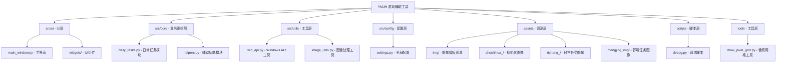
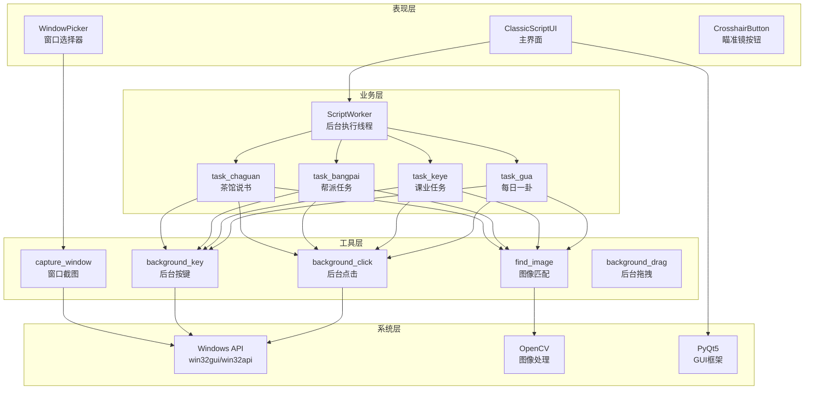
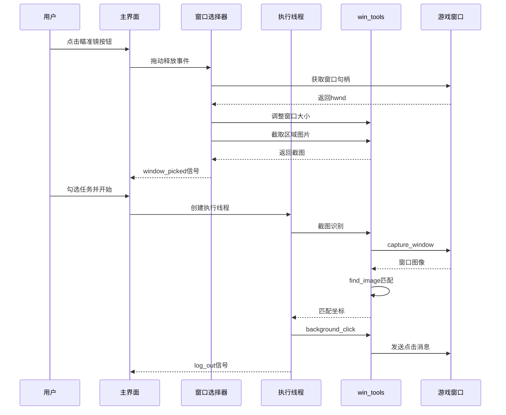
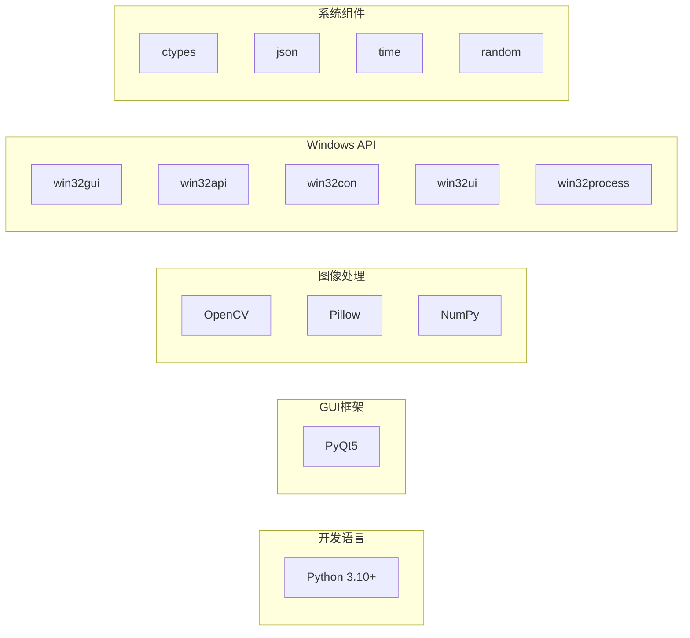
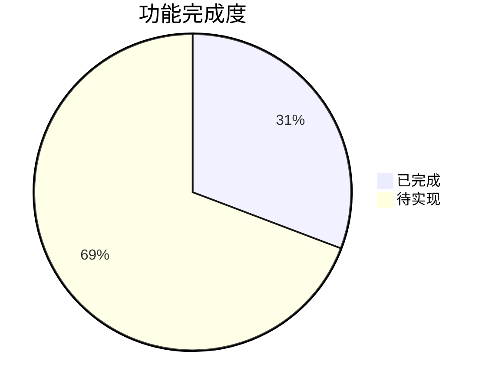

# 游戏辅助工具项目需求规划文档

## 一、执行摘要

本项目是一个基于 Python 开发的游戏辅助自动化工具，主要面向《一梦江湖》端游玩家。系统采用图像识别技术实现游戏界面元素定位，通过 Windows API 实现后台操作，使用 PyQt5 构建图形化用户界面。当前版本已实现日常任务自动化执行、窗口绑定管理、任务队列调度等核心功能。

---

## 二、项目概述

### 2.1 项目定位
- **项目名称**：YMJH 游戏辅助工具
- **目标用户**：《一梦江湖》端游玩家
- **核心价值**：自动化执行重复性游戏任务，提升玩家游戏体验效率

### 2.2 项目结构大纲

---

## 三、系统架构

### 3.1 架构层次图

### 3.2 数据流向图

---

## 四、已实现功能清单

### 4.1 核心功能模块

| 模块名称 | 功能描述 | 实现状态 | 代码位置 |
|---------|---------|---------|---------|
| 窗口绑定 | 通过瞄准镜拖拽识别并绑定游戏窗口 | ✅ 已完成 | window_picker.py |
| 窗口调整 | 自动调整游戏窗口至指定分辨率(960×540) | ✅ 已完成 | window_picker.py |
| 区域预览 | 显示绑定窗口的指定区域截图 | ✅ 已完成 | UI.py |
| 任务队列 | 支持多任务勾选和顺序执行 | ✅ 已完成 | UI.py |

### 4.2 日常任务功能

| 任务名称 | 功能描述 | 实现状态 | 关键函数 |
|---------|---------|---------|---------|
| 每日一卦 | 自动寻路、算命卜卦、接受卦象 | ✅ 已完成 | task_gua() |
| 课业任务 | 自动接取、对话、购买道具、提交 | ✅ 已完成 | task_keye() |
| 帮派任务 | 自动接取、购买、提交、全服购买 | ✅ 已完成 | task_bangpai() |
| 茶馆说书 | 自动进入茶馆、答题、退出 | ✅ 已完成 | task_chaguan() |
| 每日兑换 | - | ⏳ 待实现 | - |
| 摇钱树 | - | ⏳ 待实现 | - |
| 门客设宴 | - | ⏳ 待实现 | - |
| 破阵设宴 | - | ⏳ 待实现 | - |
| 华山论剑 | - | ⏳ 待实现 | - |
| 英雄榜 | - | ⏳ 待实现 | - |
| 每日副本 | - | ⏳ 待实现 | - |
| 聚义平冤 | - | ⏳ 待实现 | - |
| 江湖行商 | - | ⏳ 待实现 | - |

### 4.3 辅助工具功能

| 功能名称 | 功能描述 | 实现状态 | 关键函数 |
|---------|---------|---------|---------|
| 后台点击 | 向指定窗口发送鼠标点击消息 | ✅ 已完成 | background_click() |
| 后台按键 | 向指定窗口发送键盘按键消息 | ✅ 已完成 | background_key() |
| 后台拖拽 | 向指定窗口发送鼠标拖拽消息 | ✅ 已完成 | background_drag() |
| 窗口截图 | 截取指定窗口客户区图像 | ✅ 已完成 | capture_window() |
| 图像匹配 | 基于OpenCV的模板匹配 | ✅ 已完成 | find_image() |
| 窗口关闭 | 自动识别并关闭意外弹窗 | ✅ 已完成 | win_gb() |
| 脱离卡死 | 自动检测并执行脱离卡死 | ✅ 已完成 | TuiLIKaShi_set() |
| 端游设置 | 自动设置端游模式 | ✅ 已完成 | DuanYou_set() |
| 退队功能 | 自动退出队伍 | ✅ 已完成 | TuiDui_set() |
| 前往金陵 | 自动传送至金陵城 | ✅ 已完成 | JN_set() |
| 包裹管理 | 自动处理包裹满、解锁格子 | ✅ 已完成 | baoguo_manSet() |
| 像素网格 | 在截图上绘制坐标网格 | ✅ 已完成 | draw_pixel_grid() |

---

## 五、技术规格

### 5.1 技术栈

### 5.2 依赖清单

| 依赖包 | 用途 | 版本要求 |
|-------|------|---------|
| PyQt5 | GUI界面框架 | >=5.15 |
| opencv-python | 图像识别处理 | >=4.5 |
| Pillow | 图像处理 | >=8.0 |
| numpy | 数值计算 | >=1.20 |
| pywin32 | Windows API调用 | >=300 |

### 5.3 配置参数

| 参数名称 | 默认值 | 说明 |
|---------|-------|------|
| class_name | Messiah_Game | 目标窗口类名 |
| x (分辨率宽) | 960 | 游戏窗口宽度 |
| y (分辨率高) | 540 | 游戏窗口高度 |
| ui_width | 900 | 工具窗口宽度 |
| ui_height | 540 | 工具窗口高度 |
| threshold | 0.8 | 图像匹配阈值 |

---

## 六、实施状态

### 6.1 功能完成度统计

### 6.2 模块开发状态

| 模块 | 完成度 | 说明 |
|-----|-------|------|
| UI界面 | 100% | 主界面、窗口选择器、日志显示全部完成 |
| 窗口管理 | 100% | 绑定、解绑、预览功能完整 |
| 后台操作 | 100% | 点击、按键、拖拽、截图功能完整 |
| 图像识别 | 100% | 模板匹配支持ROI区域和多模板 |
| 日常任务 | 31% | 4/13个任务已实现 |

---

## 七、约束与限制

### 7.1 技术约束

1. **平台限制**：仅支持 Windows 操作系统
2. **分辨率限制**：游戏窗口必须调整为 960×540 分辨率
3. **窗口模式**：游戏需以窗口模式运行，不支持全屏
4. **后台操作**：所有自动化操作必须采用后台执行，不占用用户前台

### 7.2 功能限制

1. **图像依赖**：所有操作依赖预设的图像模板，游戏界面变化可能导致识别失败
2. **网络延迟**：未考虑网络延迟导致的界面加载时间差异
3. **异常处理**：部分异常场景处理不够完善
4. **任务中断**：暂停功能仅设置标志位，无法立即中断

### 7.3 代码质量约束

1. 部分函数圈复杂度较高（如 keye_louji、bangpai_louji）
2. 缺少单元测试覆盖
3. ~~日志输出格式不统一~~ （已解决：REQ-2026-003）
4. 部分硬编码坐标值未提取为配置

---

## 八、未来开发建议

### 8.1 短期优化（1-2周）

1. **代码重构**
   - 提取公共逻辑，降低圈复杂度
   - 将硬编码坐标移至配置文件
   - ~~统一日志输出格式~~ （已完成：REQ-2026-003）

2. **功能完善**
   - 实现剩余9个日常任务
   - 添加任务执行超时保护
   - 优化图像匹配性能

### 8.2 中期规划（1-2月）

1. **架构优化**
   - 引入任务状态机模式
   - 实现任务配置热加载
   - 添加任务执行报告

2. **用户体验**
   - 添加任务执行进度显示
   - 支持任务执行历史记录
   - 实现配置导入导出

### 8.3 长期愿景（3月+）

1. **智能化**
   - 基于OCR的文字识别
   - 基于深度学习的界面元素识别
   - 自适应分辨率支持

2. **扩展性**
   - 插件化任务系统
   - 脚本录制功能
   - 多开窗口支持

---

## 九、附录

### 9.1 文件清单

| 文件路径 | 类型 | 说明 |
|---------|------|------|
| main.py | Python | 程序入口 |
| src/ui/main_window.py | Python | 主界面模块 |
| src/ui/widgets/crosshair_button.py | Python | 瞄准镜按钮组件 |
| src/ui/widgets/window_picker.py | Python | 窗口选择器组件 |
| src/core/daily_tasks.py | Python | 日常任务模块 |
| src/core/helpers.py | Python | 辅助功能模块 |
| src/utils/win_api.py | Python | Windows API工具 |
| src/utils/image_utils.py | Python | 图像处理工具 |
| src/config/settings.py | Python | 全局配置模块 |
| scripts/debug.py | Python | 调试脚本 |
| tools/draw_pixel_grid.py | Python | 像素网格工具 |

### 9.2 图像资源统计

| 目录 | 文件数 | 用途 |
|-----|-------|------|
| assets/img/chushihua_/ | 21 | 初始化相关图像 |
| assets/img/richang_/ | 44 | 日常任务图像 |
| assets/img/mengjing_img/ | 5 | 梦境任务图像 |

---

**文档版本**：v1.2  
**创建日期**：2026-02-26  
**最后更新**：2026-02-26
