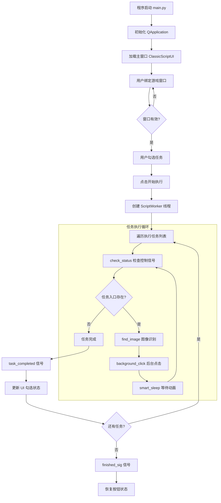

# YMJH 游戏辅助工具 - 项目上下文分析报告

> 本报告为 AI 系统提供结构化的项目背景信息，以便快速准确理解项目架构。

---

## 一、项目概览与核心链路

### 1.1 核心定位

**一款基于 Python + PyQt5 的游戏日常任务自动化辅助工具**，通过图像识别（OpenCV）与 Windows 后台消息机制，实现对游戏窗口的自动操作，解决玩家重复性日常任务的痛点。

**核心价值：**
- 自动化执行 7 大类日常任务（每日一卦、课业、帮派、茶馆、摇钱树、山河器、每日可换）
- 后台运行，不干扰用户其他操作
- 可暂停/继续/停止的任务控制机制

### 1.2 核心工作流

```
┌─────────────────────────────────────────────────────────────────────┐
│                         核心工作流                                   │
├─────────────────────────────────────────────────────────────────────┤
│                                                                     │
│  ┌──────────┐    ┌──────────┐    ┌──────────┐    ┌──────────┐     │
│  │  启动    │───►│ 窗口绑定 │───►│ 任务配置 │───►│ 执行任务 │     │
│  │ main.py  │    │ 瞄准镜   │    │ 勾选任务 │    │ 后台线程 │     │
│  └──────────┘    └──────────┘    └──────────┘    └────┬─────┘     │
│                                                       │            │
│                                                       ▼            │
│  ┌──────────┐    ┌──────────┐    ┌──────────┐    ┌──────────┐     │
│  │ 日志输出 │◄───│ 结果反馈 │◄───│ 状态更新 │◄───│ 图像识别 │     │
│  │ UI显示   │    │ UI勾选   │    │ 控制器   │    │ 模板匹配 │     │
│  └──────────┘    └──────────┘    └──────────┘    └──────────┘     │
│                                                                     │
└─────────────────────────────────────────────────────────────────────┘
```

**详细流程：**



---

## 二、技术栈与底层依赖

### 2.1 核心语言

| 语言 | 版本 | 用途 |
|------|------|------|
| **Python** | 3.10 | 主要开发语言 |

### 2.2 关键框架与库

```
┌─────────────────────────────────────────────────────────────────────┐
│                         技术栈分层                                   │
├─────────────────────────────────────────────────────────────────────┤
│                                                                     │
│  ┌─────────────────────────────────────────────────────────────┐   │
│  │                     UI 表现层                                │   │
│  │  PyQt5 >=5.15.0                                              │   │
│  │  - QMainWindow: 主窗口容器                                    │   │
│  │  - QThread: 后台任务线程                                      │   │
│  │  - pyqtSignal: 线程间通信                                     │   │
│  └─────────────────────────────────────────────────────────────┘   │
│                              │                                      │
│  ┌─────────────────────────────────────────────────────────────┐   │
│  │                     图像处理层                               │   │
│  │  opencv-python >=4.5.0  │  Pillow >=8.0.0  │  numpy >=1.20.0│   │
│  │  - cv2.matchTemplate    │  - Image.frombuffer              │   │
│  │  - 模板匹配识别         │  - 截图格式转换                   │   │
│  └─────────────────────────────────────────────────────────────┘   │
│                              │                                      │
│  ┌─────────────────────────────────────────────────────────────┐   │
│  │                     系统交互层                               │   │
│  │  pywin32 >=300                                               │   │
│  │  - win32gui: 窗口操作                                        │   │
│  │  - win32api: 消息发送                                        │   │
│  │  - win32con: 常量定义                                        │   │
│  │  - win32ui: GDI 截图                                         │   │
│  └─────────────────────────────────────────────────────────────┘   │
│                                                                     │
└─────────────────────────────────────────────────────────────────────┘
```

**依赖清单：**

| 库名 | 版本 | 核心功能 |
|------|------|----------|
| PyQt5 | >=5.15.0 | GUI 框架，主窗口、控件、信号槽机制 |
| opencv-python | >=4.5.0 | 图像识别，模板匹配 |
| Pillow | >=8.0.0 | 图像处理，截图格式转换 |
| numpy | >=1.20.0 | 数值计算，图像矩阵操作 |
| pywin32 | >=300 | Windows API 封装，后台操作 |

### 2.3 运行环境

| 项目 | 要求 |
|------|------|
| **操作系统** | Windows 10+（依赖 Win32 API） |
| **Python** | 3.10 |
| **游戏分辨率** | 960×540（固定） |
| **游戏窗口类名** | `Messiah_Game` |

---

## 三、架构设计与代码组织

### 3.1 目录结构树

```
YMJH/
│
├── main.py                      # 程序入口
├── requirements.txt             # 依赖清单
│
├── src/                         # 源代码目录
│   │
│   ├── config/                  # 【配置层】
│   │   ├── __init__.py
│   │   └── settings.py          # 全局配置类 (879行)
│   │
│   ├── core/                    # 【业务层】
│   │   ├── __init__.py
│   │   ├── controller.py        # 任务控制器 (305行)
│   │   ├── daily_tasks.py       # 日常任务逻辑 (1096行)
│   │   ├── helpers.py           # 辅助函数 (465行)
│   │   └── subtasks_meiri_kehuan.py  # 每日可换子任务 (1041行)
│   │
│   ├── ui/                      # 【界面层】
│   │   ├── __init__.py
│   │   ├── main_window.py       # 主窗口 (2424行)
│   │   └── widgets/             # 自定义控件
│   │       ├── crosshair_button.py   # 瞄准镜按钮
│   │       ├── unbind_button.py      # 解绑按钮
│   │       └── window_picker.py      # 窗口选择器
│   │
│   └── utils/                   # 【工具层】
│       ├── __init__.py
│       ├── image_utils.py       # 图像识别 (73行)
│       ├── input_tracker.py     # 输入状态追踪
│       ├── logger.py            # 日志系统 (718行)
│       └── win_api.py           # Windows API (634行)
│
├── assets/img/                  # 图像资源 (~75个模板)
│   ├── chushihua_/              # 初始化任务图像
│   ├── mengjing_img/            # 梦境任务图像
│   └── richang_/                # 日常任务图像
│
├── config/                      # 用户配置
│   └── user_task_configs.json   # 任务配置方案
│
└── docs/                        # 项目文档
    ├── 项目结构文档.md
    ├── UI配置文档.md
    └── 配置文件使用文档.md
```

### 3.2 模块职责划分

```
┌─────────────────────────────────────────────────────────────────────┐
│                       模块职责划分                                   │
├─────────────────────────────────────────────────────────────────────┤
│                                                                     │
│  ┌─────────────────────────────────────────────────────────────┐   │
│  │  UI 层 (src/ui/)                                             │   │
│  │  ┌─────────────────┐  ┌─────────────────┐                   │   │
│  │  │ main_window.py  │  │ widgets/        │                   │   │
│  │  │ - 主窗口布局    │  │ - 瞄准镜按钮    │                   │   │
│  │  │ - 任务列表面板  │  │ - 解绑按钮      │                   │   │
│  │  │ - 配置面板      │  │ - 窗口选择器    │                   │   │
│  │  │ - 日志显示      │  │                 │                   │   │
│  │  │ - ScriptWorker  │  │                 │                   │   │
│  │  └─────────────────┘  └─────────────────┘                   │   │
│  └─────────────────────────────────────────────────────────────┘   │
│                              │                                      │
│                              │ pyqtSignal                           │
│                              ▼                                      │
│  ┌─────────────────────────────────────────────────────────────┐   │
│  │  Core 层 (src/core/)                                         │   │
│  │  ┌─────────────────┐  ┌─────────────────┐                   │   │
│  │  │ controller.py   │  │ daily_tasks.py  │                   │   │
│  │  │ - 任务控制器    │  │ - 每日一卦      │                   │   │
│  │  │ - 暂停/继续/停止│  │ - 课业任务      │                   │   │
│  │  │ - smart_sleep   │  │ - 帮派任务      │                   │   │
│  │  │ - 异常定义      │  │ - 茶馆说书      │                   │   │
│  │  └─────────────────┘  │ - 摇钱树        │                   │   │
│  │                        │ - 山河器        │                   │   │
│  │  ┌─────────────────┐  │ - 每日可换      │                   │   │
│  │  │ helpers.py      │  └─────────────────┘                   │   │
│  │  │ - win_gb 关闭窗口│                                       │   │
│  │  │ - zhd 打开活动  │  ┌─────────────────┐                   │   │
│  │  │ - JN_set 前往金陵│ │ subtasks_*.py   │                   │   │
│  │  │ - TuiLIKaShi_set│  │ - 子任务实现    │                   │   │
│  │  └─────────────────┘  └─────────────────┘                   │   │
│  └─────────────────────────────────────────────────────────────┘   │
│                              │                                      │
│                              │ 函数调用                             │
│                              ▼                                      │
│  ┌─────────────────────────────────────────────────────────────┐   │
│  │  Utils 层 (src/utils/)                                       │   │
│  │  ┌─────────────────┐  ┌─────────────────┐                   │   │
│  │  │ win_api.py      │  │ image_utils.py  │                   │   │
│  │  │ - bind_window   │  │ - find_image    │                   │   │
│  │  │ - capture_window│  │ - 模板匹配      │                   │   │
│  │  │ - background_   │  └─────────────────┘                   │   │
│  │  │   click/key/drag│                                        │   │
│  │  │ - release_      │  ┌─────────────────┐                   │   │
│  │  │   tracked_inputs│  │ logger.py       │                   │   │
│  │  └─────────────────┘  │ - LogManager    │                   │   │
│  │                        │ - get_logger    │                   │   │
│  │  ┌─────────────────┐  │ - 信号日志      │                   │   │
│  │  │ input_tracker.py│  └─────────────────┘                   │   │
│  │  │ - 按键状态追踪  │                                        │   │
│  │  │ - 鼠标状态追踪  │                                        │   │
│  │  └─────────────────┘                                        │   │
│  └─────────────────────────────────────────────────────────────┘   │
│                              │                                      │
│                              │ 读取配置                             │
│                              ▼                                      │
│  ┌─────────────────────────────────────────────────────────────┐   │
│  │  Config 层 (src/config/)                                     │   │
│  │  ┌─────────────────────────────────────────────────────┐    │   │
│  │  │ settings.py                                          │    │   │
│  │  │ - app_name, class_name, 分辨率                       │    │   │
│  │  │ - daily_tasks: 任务列表                              │    │   │
│  │  │ - task_config_definitions: 任务配置定义              │    │   │
│  │  │ - ui_sizes, ui_layout: UI 尺寸配置                   │    │   │
│  │  │ - VK_CODE: 按键映射                                  │    │   │
│  │  │ - saved_configs: 用户配置方案                        │    │   │
│  │  └─────────────────────────────────────────────────────┘    │   │
│  └─────────────────────────────────────────────────────────────┘   │
│                                                                     │
└─────────────────────────────────────────────────────────────────────┘
```

### 3.3 核心机制

#### 3.3.1 多线程架构

```
┌─────────────────────────────────────────────────────────────────────┐
│                       多线程架构                                     │
├─────────────────────────────────────────────────────────────────────┤
│                                                                     │
│  ┌──────────────────┐         ┌──────────────────┐                 │
│  │   主线程 (UI)     │         │  工作线程 (Worker) │                 │
│  │                  │         │                  │                 │
│  │  QApplication    │         │  ScriptWorker    │                 │
│  │  ClassicScriptUI │         │  (QThread)       │                 │
│  │                  │         │                  │                 │
│  │  - 接收用户操作  │◄────────│  - 执行任务循环  │                 │
│  │  - 更新界面状态  │ 信号    │  - 图像识别      │                 │
│  │  - 显示日志      │         │  - 后台操作      │                 │
│  │                  │         │  - 状态检查      │                 │
│  └────────┬─────────┘         └────────┬─────────┘                 │
│           │                            │                            │
│           │         控制信号           │                            │
│           │    ┌──────────────┐        │                            │
│           └───►│TaskController│◄───────┘                            │
│                │  (单例)      │                                     │
│                │              │                                     │
│                │ _pause_event │                                     │
│                │ _stop_event  │                                     │
│                └──────────────┘                                     │
│                                                                     │
└─────────────────────────────────────────────────────────────────────┘
```

**关键类：**

| 类名 | 位置 | 职责 |
|------|------|------|
| `ScriptWorker` | main_window.py | QThread 子类，后台执行任务 |
| `TaskController` | controller.py | 单例，控制暂停/继续/停止 |
| `InputTracker` | input_tracker.py | 单例，追踪输入状态 |

#### 3.3.2 线程间通信

```python
# 信号定义 (main_window.py)
class ScriptWorker(QThread):
    finished_sig = pyqtSignal()           # 任务完成
    task_completed = pyqtSignal(str, object)  # 单任务完成

# 信号连接
self.worker.finished_sig.connect(self._on_task_finished)
self.worker.task_completed.connect(self._on_task_completed)

# 控制器同步 (controller.py)
class TaskController:
    _pause_event: threading.Event  # True=放行，False=阻塞
    _stop_event: threading.Event   # True=触发停止
```

#### 3.3.3 设计模式

| 模式 | 应用位置 | 说明 |
|------|----------|------|
| **单例模式** | TaskController, InputTracker, Config, LogManager | 全局唯一实例 |
| **观察者模式** | PyQt 信号槽 | UI 与 Worker 解耦通信 |
| **状态机模式** | ButtonState | 按钮状态管理 (IDLE/RUNNING/PAUSED/STOPPING) |
| **模板方法** | 任务函数结构 | 统一的任务执行框架 |

#### 3.3.4 任务执行模式

```python
# 典型任务函数结构
def task_xxx(hwnd, log_signal=None):
    max_task_attempts = 6  # 防卡死重试上限
    
    for attempt in range(1, max_task_attempts + 1):
        task_controller.check_status()  # 检查控制信号
        
        # 1. 准备阶段
        zhd(hwnd)  # 打开活动界面
        
        # 2. 检查任务入口
        pos = find_image(hwnd, template_path, threshold=0.8)
        if pos is None:
            return True  # 任务已完成
        
        # 3. 执行操作
        background_click(hwnd, x, y)
        task_controller.smart_sleep(3)  # 可中断等待
        
        # 4. 确认结果
        # ...
    
    return False  # 执行失败
```

---

## 四、现状评估与潜在隐患

### 4.1 代码耦合度评估

```
┌─────────────────────────────────────────────────────────────────────┐
│                       耦合度评估                                     │
├─────────────────────────────────────────────────────────────────────┤
│                                                                     │
│  耦合度等级: ████████░░ 中高 (需关注)                               │
│                                                                     │
│  ┌─────────────────────────────────────────────────────────────┐   │
│  │  问题 1: main_window.py 过于庞大 (2424行)                   │   │
│  │  - 包含 UI 布局、任务调度、配置管理、日志显示               │   │
│  │  - 建议: 拆分为 panels/ 目录下的独立面板                    │   │
│  └─────────────────────────────────────────────────────────────┘   │
│                                                                     │
│  ┌─────────────────────────────────────────────────────────────┐   │
│  │  问题 2: 任务注册硬编码                                      │   │
│  │  logic_map = {                                              │   │
│  │      "每日一卦": task_gua,                                  │   │
│  │      "课业任务": task_keye,                                 │   │
│  │      ...                                                    │   │
│  │  }                                                          │   │
│  │  - 添加新任务需修改多处代码                                  │   │
│  │  - 建议: 使用装饰器 + 注册表模式                            │   │
│  └─────────────────────────────────────────────────────────────┘   │
│                                                                     │
│  ┌─────────────────────────────────────────────────────────────┐   │
│  │  问题 3: 坐标硬编码散落各处                                  │   │
│  │  background_click(hwnd, 521, 476, ...)  # 魔法数字          │   │
│  │  - 建议: 提取到 coordinates.py 配置文件                     │   │
│  └─────────────────────────────────────────────────────────────┘   │
│                                                                     │
│  ┌─────────────────────────────────────────────────────────────┐   │
│  │  优点: UI 与 业务逻辑分离良好                                │   │
│  │  - UI 层不直接调用 win_api                                  │   │
│  │  - 通过 ScriptWorker 线程隔离                               │   │
│  └─────────────────────────────────────────────────────────────┘   │
│                                                                     │
└─────────────────────────────────────────────────────────────────────┘
```

### 4.2 潜在风险点

#### 风险 1: 性能瓶颈 - 频繁截图

```
问题: find_image 每次调用都会截图和加载模板

调用链:
find_image() → capture_window() → cv2.cvtColor() → cv2.imread() → cv2.matchTemplate()

时间消耗:
- 截图: ~15-30ms
- 颜色转换: ~2-5ms  
- 模板加载: ~5-10ms
- 模板匹配: ~10-20ms
- 总计: ~32-65ms/次

影响: 任务循环内每秒调用 5-10 次，CPU 占用 5-15%

建议: 
1. 实现帧缓存机制 (FrameCache)
2. 模板预加载 + LRU 缓存 (TemplateCache)
```

#### 风险 2: 动画等待不够灵活

```
问题: 固定延时无法适应动画时长变化

当前实现:
background_click(hwnd, x, y)
task_controller.smart_sleep(3)  # 固定等待3秒

问题:
- 动画可能2秒结束 → 浪费1秒
- 动画可能4秒 → 点击失败

建议:
1. 实现动画结束检测 (连续帧对比)
2. 状态确认机制 (点击后验证是否生效)
```

#### 风险 3: 异常处理不完善

```
问题: 部分循环缺少超时保护

已修复: 任务主循环已加入 max_attempts
未完善: 
- 点击无确认机制
- 窗口最小化后截图失败无备选方案
- 游戏界面变化导致识别失败无多分辨率适配

建议:
1. 动作确认 + 重试机制 (ActionExecutor)
2. 多截图方式支持 (BitBlt/PrintWindow/DXGI)
3. 状态快照 + 自动恢复
```

#### 风险 4: 线程安全

```
当前状态: 基本安全

✅ 已有保护:
- TaskController 使用 threading.Lock 保护单例创建
- InputTracker 使用 threading.Lock 保护状态字典
- PyQt 信号槽实现线程间安全通信

⚠️ 潜在问题:
- Config 类非线程安全 (多线程读取配置)
- 日志系统文件写入无锁保护
```

### 4.3 优化建议优先级

| 优先级 | 优化项 | 预期收益 | 实施难度 |
|--------|--------|----------|----------|
| **P0** | 帧缓存机制 | CPU 降低 30-50% | 低 |
| **P0** | 模板预加载 | 响应速度提升 20% | 低 |
| **P1** | 动作确认机制 | 稳定性提升 40% | 中 |
| **P1** | 坐标配置提取 | 可维护性提升 | 低 |
| **P2** | 任务注册表 | 扩展性提升 | 中 |
| **P2** | 文件拆分 | 可维护性提升 | 中 |

---

## 五、关键文件清单

| 文件 | 行数 | 核心职责 |
|------|------|----------|
| [main_window.py](file:///e:/Tare_project/YMJH/src/ui/main_window.py) | 2424 | 主界面、任务调度、配置管理 |
| [daily_tasks.py](file:///e:/Tare_project/YMJH/src/core/daily_tasks.py) | 1096 | 日常任务自动化逻辑 |
| [subtasks_meiri_kehuan.py](file:///e:/Tare_project/YMJH/src/core/subtasks_meiri_kehuan.py) | 1041 | 每日可换子任务实现 |
| [settings.py](file:///e:/Tare_project/YMJH/src/config/settings.py) | 879 | 全局配置管理 |
| [logger.py](file:///e:/Tare_project/YMJH/src/utils/logger.py) | 718 | 日志系统 |
| [win_api.py](file:///e:/Tare_project/YMJH/src/utils/win_api.py) | 634 | Windows API 封装 |
| [helpers.py](file:///e:/Tare_project/YMJH/src/core/helpers.py) | 465 | 辅助函数 |
| [controller.py](file:///e:/Tare_project/YMJH/src/core/controller.py) | 305 | 任务控制器 |
| [image_utils.py](file:///e:/Tare_project/YMJH/src/utils/image_utils.py) | 73 | 图像识别 |

---

## 六、快速上手指南

### 对于 AI 系统的上下文理解要点

1. **项目本质**: 这是一个游戏自动化工具，核心是"图像识别 + 后台操作"

2. **修改任务逻辑**: 
   - 主任务: `src/core/daily_tasks.py`
   - 子任务: `src/core/subtasks_meiri_kehuan.py`

3. **修改 UI**:
   - 主窗口: `src/ui/main_window.py`
   - 自定义控件: `src/ui/widgets/`

4. **修改配置**:
   - 全局配置: `src/config/settings.py`
   - 用户配置: `config/user_task_configs.json`

5. **核心 API**:
   - 图像识别: `find_image(hwnd, template_path, threshold=0.8)`
   - 后台点击: `background_click(hwnd, x, y, button="left")`
   - 后台按键: `background_key(hwnd, key)`
   - 可中断等待: `task_controller.smart_sleep(seconds)`

---

**报告版本**: v1.0  
**生成日期**: 2026-03-09  
**项目代码行数**: ~7,500 行（不含注释）
