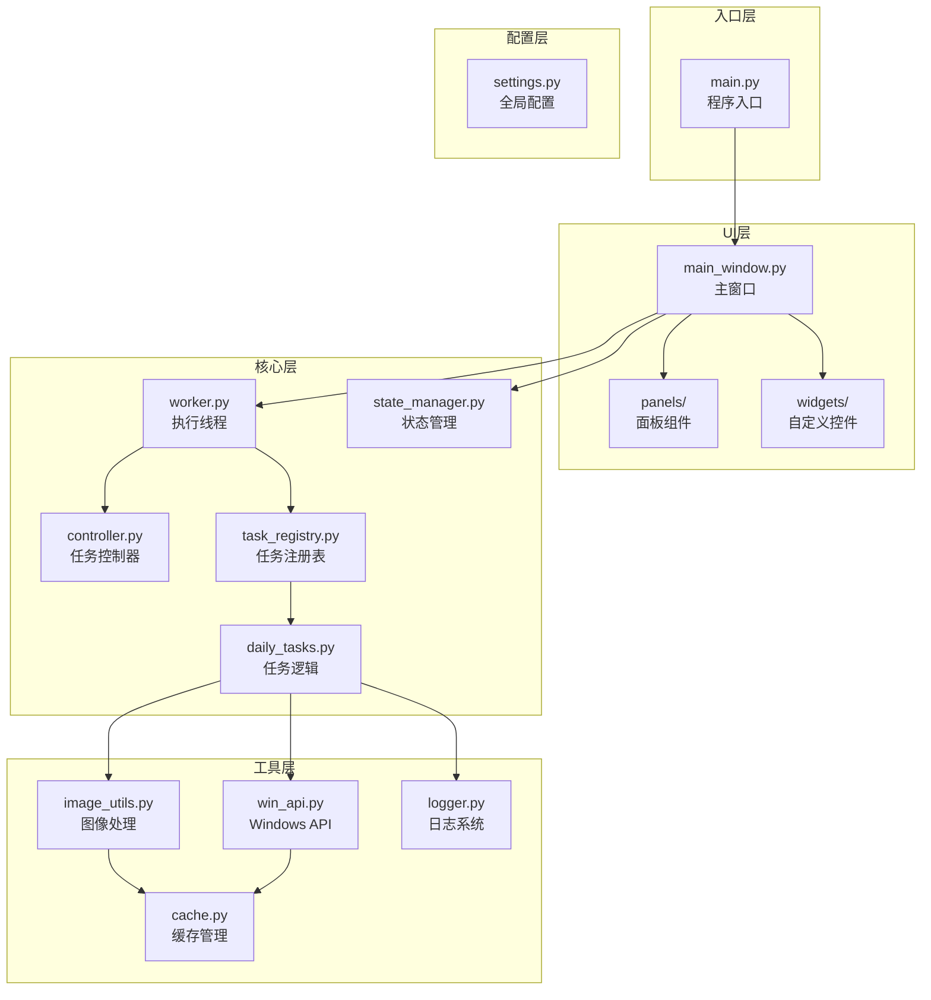
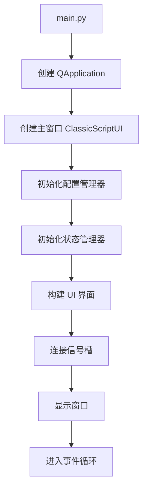
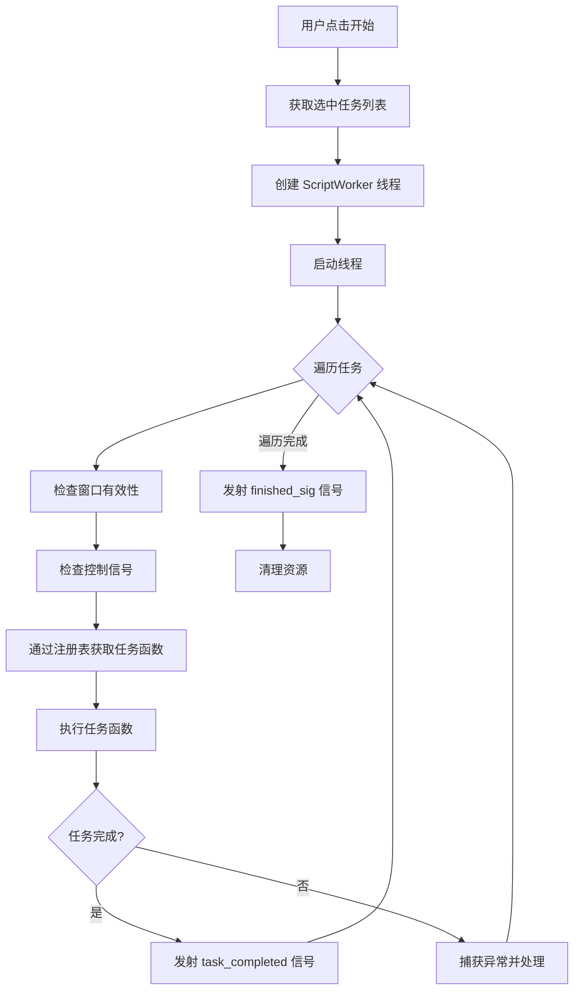
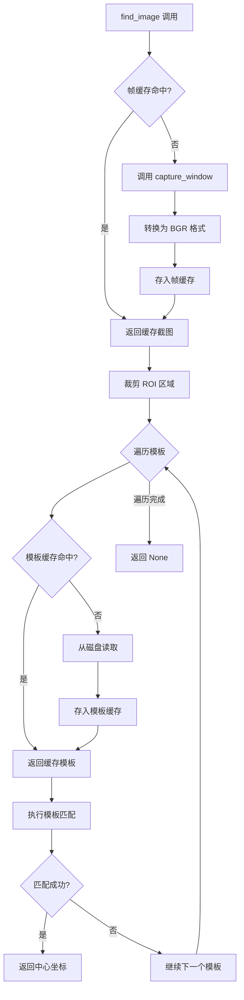
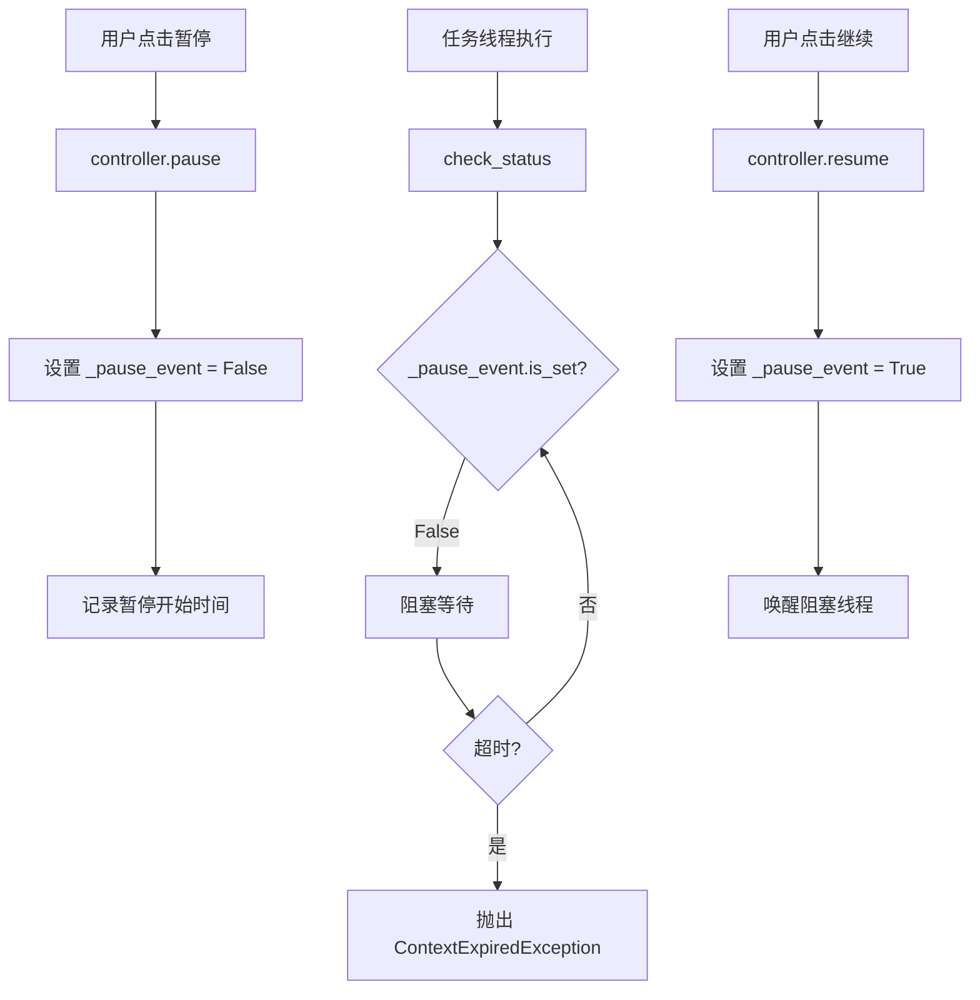

# YMJH 游戏辅助工具 - 项目技术文档

> **版本**: 1.0.0  
> **更新日期**: 2026-03-09  
> **适用对象**: 新团队成员、项目维护者

---

## 目录

1. [项目概述](#1-项目概述)
2. [开发环境配置](#2-开发环境配置)
3. [项目结构](#3-项目结构)
4. [技术架构设计](#4-技术架构设计)
5. [核心功能模块](#5-核心功能模块)
6. [主要API接口说明](#6-主要api接口说明)
7. [关键业务流程](#7-关键业务流程)
8. [配置管理](#8-配置管理)
9. [常见问题解决方案](#9-常见问题解决方案)
10. [未来迭代计划](#10-未来迭代计划)

---

## 1. 项目概述

### 1.1 项目简介

**YMJH**（糊批解放器）是一款基于 Python 的游戏辅助工具，通过图像识别和 Windows API 实现游戏日常任务的自动化执行。项目采用 PyQt5 构建图形界面，支持后台运行，不影响用户正常使用电脑。

### 1.2 核心特性

| 特性 | 说明 |
|------|------|
| **后台执行** | 通过 Windows 消息机制实现后台点击、按键、拖拽 |
| **图像识别** | 基于 OpenCV 模板匹配，自动识别游戏界面元素 |
| **任务自动化** | 支持 20+ 种日常任务的一键自动执行 |
| **暂停/继续** | 支持任务执行过程中的暂停和继续操作 |
| **配置保存** | 支持任务配置方案的保存和加载 |
| **双重缓存** | 帧缓存和模板缓存优化，显著提升性能 |

### 1.3 技术栈

```
┌─────────────────────────────────────────────────────────┐
│                      技术栈概览                          │
├─────────────────────────────────────────────────────────┤
│  语言: Python 3.10                                      │
│  GUI:  PyQt5 5.15+                                      │
│  图像: OpenCV 4.5+, Pillow 8.0+, NumPy 1.20+           │
│  系统: pywin32 300+ (Windows API)                       │
│  平台: Windows 10                                       │
└─────────────────────────────────────────────────────────┘
```

---

## 2. 开发环境配置

### 2.1 环境要求

- **操作系统**: Windows 10 或更高版本
- **Python**: 3.10.x
- **内存**: 建议 4GB 以上
- **磁盘**: 至少 500MB 可用空间

### 2.2 环境搭建

```bash
# 1. 创建 Conda 虚拟环境
conda create -n ymjh_venv python=3.10

# 2. 激活虚拟环境
conda activate ymjh_venv

# 3. 进入项目目录
cd e:\Tare_project\YMJH

# 4. 安装依赖
pip install -r requirements.txt

# 5. 运行程序
python main.py
```

### 2.3 依赖清单

| 包名 | 版本 | 用途 |
|------|------|------|
| PyQt5 | >=5.15.0 | GUI 框架 |
| opencv-python | >=4.5.0 | 图像处理与模板匹配 |
| Pillow | >=8.0.0 | 图像读取与转换 |
| numpy | >=1.20.0 | 数值计算与矩阵操作 |
| pywin32 | >=300 | Windows API 调用 |

### 2.4 IDE 配置

推荐使用 VS Code 或 PyCharm，配置要点：

- 编码格式：UTF-8
- 换行符：LF
- Python 解释器：指向 `ymjh_venv` 环境

---

## 3. 项目结构

### 3.1 目录树

```
e:\Tare_project\YMJH\
│
├── main.py                          # 程序入口
├── requirements.txt                 # 依赖清单
│
├── src/                             # 源代码目录
│   ├── config/                      # 配置模块
│   │   └── settings.py              # 全局配置类
│   │
│   ├── core/                        # 核心业务逻辑
│   │   ├── controller.py            # 任务控制器
│   │   ├── worker.py                # 后台执行线程
│   │   ├── task_registry.py         # 任务注册表
│   │   ├── state_manager.py         # 状态管理器
│   │   ├── config_manager.py        # 配置管理器
│   │   ├── daily_tasks.py           # 日常任务逻辑
│   │   ├── helpers.py               # 辅助函数
│   │   └── subtasks_meiri_kehuan.py # 子任务模块
│   │
│   ├── ui/                          # 用户界面层
│   │   ├── main_window.py           # 主窗口
│   │   ├── panels/                  # 面板组件
│   │   │   ├── bottom_panel.py      # 底部控制面板
│   │   │   ├── log_panel.py         # 日志面板
│   │   │   ├── task_list_panel.py   # 任务列表
│   │   │   └── task_config_panel.py # 任务配置
│   │   ├── widgets/                 # 自定义控件
│   │   │   ├── window_picker.py     # 窗口选择器
│   │   │   └── ...
│   │   └── styles/                  # 样式模块
│   │       └── color_scheme.py      # 配色方案
│   │
│   └── utils/                       # 工具模块
│       ├── win_api.py               # Windows API 封装
│       ├── image_utils.py           # 图像处理
│       ├── cache.py                 # 缓存管理
│       ├── logger.py                # 日志系统
│       └── input_tracker.py         # 输入状态追踪
│
├── assets/                          # 静态资源
│   └── img/                         # 图像模板
│       ├── chushihua_/              # 初始化图像
│       ├── richang_/                # 日常任务图像
│       └── ...
│
├── config/                          # 运行时配置
│   └── user_task_configs.json       # 用户配置方案
│
├── docs/                            # 项目文档
│   ├── 项目结构文档.md
│   ├── 配置文件使用文档.md
│   └── ...
│
└── tests/                           # 测试代码
```

### 3.2 模块职责

```
┌─────────────────────────────────────────────────────────────┐
│                      模块职责划分                            │
├─────────────────────────────────────────────────────────────┤
│                                                             │
│  config/     配置管理 - 窗口参数、任务列表、UI尺寸等         │
│                                                             │
│  core/       业务逻辑 - 任务控制、执行、状态管理             │
│                                                             │
│  ui/         界面展示 - 主窗口、面板、控件、样式             │
│                                                             │
│  utils/      工具函数 - API封装、图像处理、日志、缓存        │
│                                                             │
│  assets/     静态资源 - 图像模板、图标等                     │
│                                                             │
└─────────────────────────────────────────────────────────────┘
```

---

## 4. 技术架构设计

### 4.1 整体架构



### 4.2 核心设计模式

#### 4.2.1 单例模式

项目中多个核心类采用单例模式，确保全局唯一实例：

```python
# 示例：TaskController 单例实现
class TaskController:
    _instance = None
    _lock = threading.Lock()
    
    def __new__(cls):
        if cls._instance is None:
            with cls._lock:
                if cls._instance is None:
                    cls._instance = super().__new__(cls)
        return cls._instance
```

**应用场景**：
- `TaskController` - 任务控制器
- `StateManager` - 状态管理器
- `TemplateCache` - 模板缓存
- `FrameCache` - 帧缓存
- `LogManager` - 日志管理器

#### 4.2.2 注册表模式

任务注册表实现任务名称与函数的解耦映射：

```python
# 注册任务
@register_task("每日一卦")
def task_gua(hwnd):
    ...

# 获取任务
task_func = get_task("每日一卦")
```

#### 4.2.3 观察者模式

状态管理器通过 PyQt 信号实现状态变更通知：

```python
# 状态变更时发射信号
self.state_changed.emit(new_state)

# UI 层连接信号
self.state_manager.state_changed.connect(self._update_button_ui)
```

### 4.3 线程模型

```
┌─────────────────────────────────────────────────────────────┐
│                      线程模型                                │
├─────────────────────────────────────────────────────────────┤
│                                                             │
│  ┌─────────────────┐     ┌─────────────────┐               │
│  │   主线程 (UI)    │     │  工作线程 (Worker) │              │
│  │                 │     │                 │               │
│  │  - 界面渲染      │     │  - 任务执行      │               │
│  │  - 用户交互      │     │  - 图像识别      │               │
│  │  - 状态更新      │     │  - 自动化操作    │               │
│  │                 │     │                 │               │
│  │  ┌───────────┐  │     │  ┌───────────┐  │               │
│  │  │ 信号槽连接 │◄─┼─────┼──│ 任务完成   │  │               │
│  │  └───────────┘  │     │  └───────────┘  │               │
│  └─────────────────┘     └─────────────────┘               │
│                                                             │
│  同步机制: threading.Event (暂停/继续/停止)                  │
│                                                             │
└─────────────────────────────────────────────────────────────┘
```

---

## 5. 核心功能模块

### 5.1 任务控制器 (controller.py)

**职责**：管理任务的暂停、继续、停止状态

```python
class TaskController:
    """
    任务控制器单例类
    
    核心方法：
        - pause(): 暂停任务
        - resume(): 继续任务
        - stop(): 停止任务
        - check_status(): 检查状态（任务中调用）
        - smart_sleep(): 智能睡眠（支持暂停响应）
    """
```

**异常类型**：
- `TaskStoppedException` - 用户强制停止
- `ContextExpiredException` - 暂停超时导致上下文过期
- `InvalidWindowHandleException` - 窗口句柄无效

### 5.2 任务执行线程 (worker.py)

**职责**：在后台执行用户选择的任务

```python
class ScriptWorker(QThread):
    """
    后台脚本执行线程
    
    信号：
        - finished_sig: 任务完成
        - task_completed: 单个任务完成 (task_name, result)
    """
```

### 5.3 任务注册表 (task_registry.py)

**职责**：管理任务名称与函数的映射

```python
# 装饰器注册
@register_task("任务名称")
def task_xxx(hwnd):
    ...

# 获取任务
task_func = get_task("任务名称")
```

### 5.4 Windows API 封装 (win_api.py)

**职责**：封装 Windows 底层操作

| 函数 | 功能 |
|------|------|
| `bind_window()` | 绑定游戏窗口 |
| `capture_window()` | 截取窗口画面 |
| `background_click()` | 后台点击 |
| `background_key()` | 后台按键 |
| `background_drag()` | 后台拖拽 |

### 5.5 图像处理 (image_utils.py)

**职责**：图像识别与模板匹配

```python
def find_image(hwnd, template_path, roi=None, threshold=0.8):
    """
    在窗口中查找模板图片
    
    参数：
        hwnd: 窗口句柄
        template_path: 模板路径（支持列表）
        roi: 查找区域 [x, y, w, h]
        threshold: 匹配阈值
    
    返回：
        (center_x, center_y) 或 None
    """
```

### 5.6 缓存管理 (cache.py)

**职责**：优化图像识别性能

```python
class TemplateCache:
    """模板图片缓存（懒加载、线程安全、中文路径兼容）"""
    
class FrameCache:
    """截图帧缓存（TTL过期、线程安全、支持强制清除）"""
```

---

## 6. 主要API接口说明

### 6.1 Windows API 接口

#### bind_window - 窗口绑定

```python
def bind_window(title=None, class_name=None, index=0, pid=None, pick=False, timeout=10):
    """
    绑定窗口句柄
    
    参数：
        title: 窗口标题（模糊匹配）
        class_name: 窗口类名（精确匹配）
        index: 多开时选择第几个
        pid: 进程 PID（最高精度）
        pick: 是否启用鼠标点选
        timeout: 等待超时时间
    
    返回：
        hwnd (int) 或 None
    """
```

#### background_click - 后台点击

```python
def background_click(hwnd, x, y, button="left", action="click", delay=50):
    """
    后台点击
    
    参数：
        hwnd: 窗口句柄
        x, y: 点击坐标（客户区坐标）
        button: "left" | "right" | "middle"
        action: "click" | "down" | "up" | "double"
        delay: 按下与抬起延迟（毫秒）
    
    返回：
        bool: 操作是否成功
    """
```

#### capture_window - 窗口截图

```python
def capture_window(hwnd, save_path=None):
    """
    截取窗口客户区图像
    
    参数：
        hwnd: 窗口句柄
        save_path: 保存路径（可选）
    
    返回：
        PIL.Image 或 None
    """
```

### 6.2 图像识别接口

#### find_image - 模板匹配

```python
def find_image(hwnd, template_path, roi=None, threshold=0.8, use_grayscale=False):
    """
    在窗口中查找模板图片
    
    参数：
        hwnd: 窗口句柄
        template_path: 模板路径（字符串或列表）
        roi: 裁剪区域 [x, y, w, h]
        threshold: 匹配阈值（0-1）
        use_grayscale: 是否使用灰度图匹配
    
    返回：
        (center_x, center_y) 或 None
    """
```

### 6.3 任务控制接口

```python
# 获取控制器实例
controller = TaskController.get_instance()

# 控制操作
controller.pause()    # 暂停
controller.resume()   # 继续
controller.stop()     # 停止

# 任务中检查状态
controller.check_status()  # 检查是否需要停止或暂停

# 智能睡眠（支持暂停响应）
controller.smart_sleep(seconds)
```

### 6.4 日志接口

```python
from src.utils.logger import get_logger

logger = get_logger('module_name')

logger.debug("调试信息")
logger.info("一般信息")
logger.success("成功信息")
logger.warning("警告信息")
logger.error("错误信息", exc_info=True)
```

---

## 7. 关键业务流程

### 7.1 程序启动流程



### 7.2 任务执行流程



### 7.3 图像识别流程



### 7.4 暂停/继续流程



---

## 8. 配置管理

### 8.1 全局配置类 (settings.py)

```python
class Config:
    # 窗口配置
    app_name = '糊批解放器'
    class_name = 'Messiah_Game'
    x = 960  # 游戏窗口宽度
    y = 540  # 游戏窗口高度
    
    # UI 配置
    ui_width = 900
    ui_height = 540
    
    # 任务列表
    daily_tasks = ["每日一卦", "课业任务", ...]
    
    # 按键映射
    VK_CODE = {"ENTER": 13, "ESC": 27, ...}
    
    # 任务控制
    pause_timeout_threshold = 300  # 暂停超时阈值（秒）
```

### 8.2 用户配置方案

配置文件路径：`config/user_task_configs.json`

```json
{
  "方案名称": {
    "每日一卦": true,
    "课业任务": true,
    "摇钱树": {
      "choice": 1
    }
  }
}
```

### 8.3 图像资源路径

```python
# 获取图像路径
path = config.get_img_path("richang_/mryg.png")
# 返回: assets/img/richang_/mryg.png
```

---

## 9. 常见问题解决方案

### 9.1 窗口绑定失败

**问题**：无法绑定游戏窗口

**解决方案**：
1. 确认游戏窗口已打开且未最小化
2. 检查窗口类名是否正确（使用 Spy++ 工具查看）
3. 尝试使用鼠标点选模式：`bind_window(pick=True)`

### 9.2 图像识别失败

**问题**：模板匹配始终返回 None

**解决方案**：
1. 检查模板图片是否存在
2. 降低匹配阈值（默认 0.8）
3. 确认游戏分辨率与配置一致
4. 检查 ROI 区域是否正确

### 9.3 中文路径问题

**问题**：模板图片路径包含中文时读取失败

**解决方案**：
项目已使用 `cv2.imdecode(np.fromfile(...))` 替代 `cv2.imread()`，自动兼容中文路径。

### 9.4 任务执行卡死

**问题**：任务执行过程中无响应

**解决方案**：
1. 检查是否触发了暂停状态
2. 查看日志是否有异常信息
3. 确认游戏窗口未被遮挡或最小化

### 9.5 线程安全问题

**问题**：多线程访问导致数据竞争

**解决方案**：
项目核心类均使用 `threading.Lock()` 保护共享资源，确保线程安全。

---

## 10. 未来迭代计划

### 10.1 短期计划 (v1.1)

- [ ] 增加更多日常任务支持
- [ ] 优化图像识别算法（多尺度匹配）
- [ ] 添加任务执行统计功能
- [ ] 支持自定义脚本编写

### 10.2 中期计划 (v1.5)

- [ ] 引入 OCR 文字识别
- [ ] 支持多开窗口并行执行
- [ ] 添加远程控制功能
- [ ] 实现任务调度器

### 10.3 长期计划 (v2.0)

- [ ] AI 辅助决策系统
- [ ] 云端配置同步
- [ ] 跨平台支持
- [ ] 插件系统架构

---

## 附录

### A. 项目文件索引

| 文件 | 路径 | 说明 |
|------|------|------|
| 程序入口 | [main.py](file:///e:/Tare_project/YMJH/main.py) | 启动文件 |
| 全局配置 | [settings.py](file:///e:/Tare_project/YMJH/src/config/settings.py) | 配置类 |
| 任务控制器 | [controller.py](file:///e:/Tare_project/YMJH/src/core/controller.py) | 暂停/继续/停止 |
| 任务注册表 | [task_registry.py](file:///e:/Tare_project/YMJH/src/core/task_registry.py) | 任务映射 |
| 执行线程 | [worker.py](file:///e:/Tare_project/YMJH/src/core/worker.py) | 后台执行 |
| 主窗口 | [main_window.py](file:///e:/Tare_project/YMJH/src/ui/main_window.py) | UI 主类 |
| Windows API | [win_api.py](file:///e:/Tare_project/YMJH/src/utils/win_api.py) | 系统接口 |
| 图像处理 | [image_utils.py](file:///e:/Tare_project/YMJH/src/utils/image_utils.py) | 模板匹配 |
| 缓存管理 | [cache.py](file:///e:/Tare_project/YMJH/src/utils/cache.py) | 性能优化 |

### B. 相关文档

- [项目结构文档](file:///e:/Tare_project/YMJH/docs/项目结构文档.md)
- [配置文件使用文档](file:///e:/Tare_project/YMJH/docs/配置文件使用文档.md)
- [UI配置文档](file:///e:/Tare_project/YMJH/docs/UI配置文档.md)
- [任务控制方案](file:///e:/Tare_project/YMJH/docs/任务控制方案.md)
- [图像识别流水线性能分析](file:///e:/Tare_project/YMJH/docs/图像识别流水线性能分析.md)

---

*文档版本: 1.0.0 | 最后更新: 2026-03-09*
