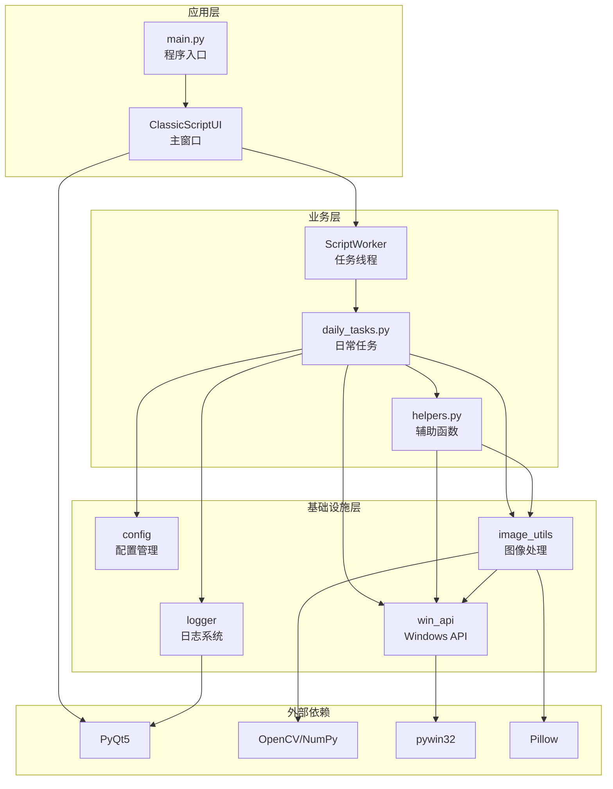
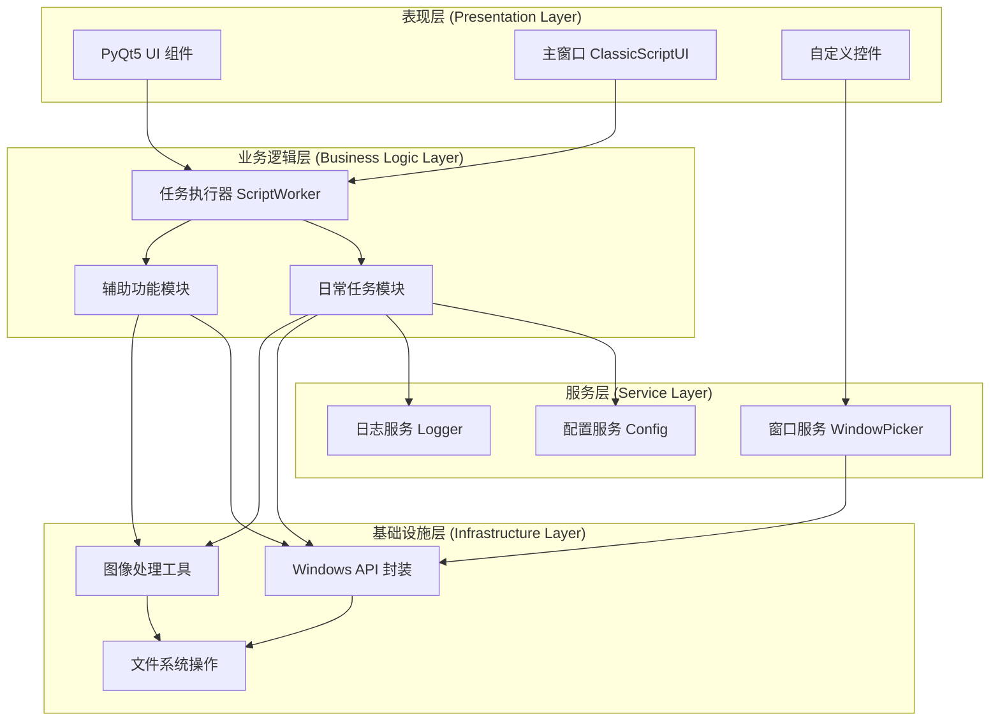
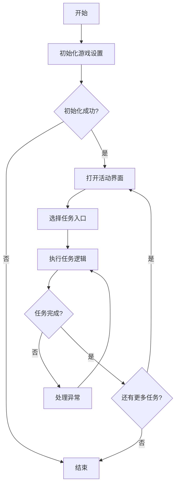
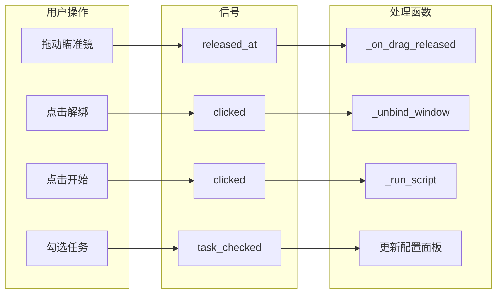
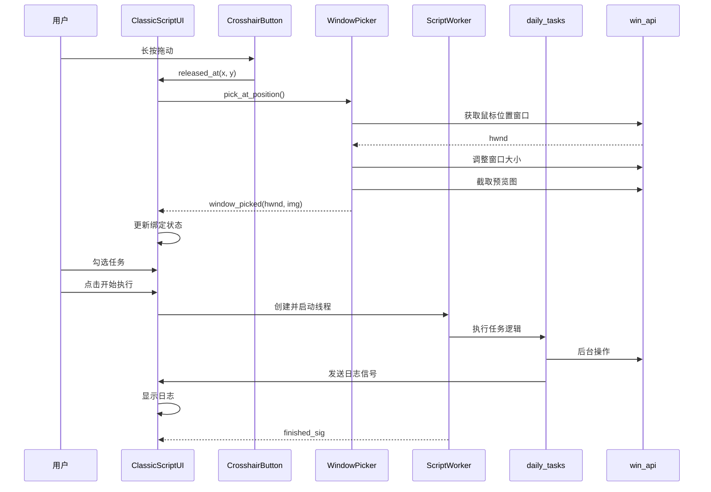
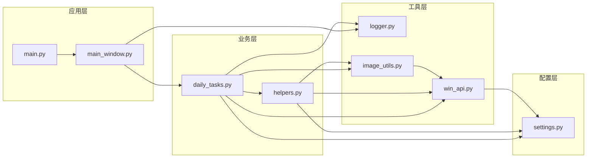

# YMJH 项目教学文档

> **版本**: v1.0  
> **创建日期**: 2026-03-05  
> **适用对象**: 开发人员、维护人员、新成员

---

## 目录

1. [项目概述](#1-项目概述)
2. [目录结构](#2-目录结构)
3. [技术栈](#3-技术栈)
4. [系统架构](#4-系统架构)
5. [模块详解](#5-模块详解)
   - 5.1 [配置模块 (src/config)](#51-配置模块-srcconfig)
   - 5.2 [核心业务模块 (src/core)](#52-核心业务模块-srccore)
   - 5.3 [UI 模块 (src/ui)](#53-ui-模块-srcui)
   - 5.4 [工具模块 (src/utils)](#54-工具模块-srcutils)
6. [数据流与组件交互](#6-数据流与组件交互)
7. [配置与依赖](#7-配置与依赖)
8. [快速开始](#8-快速开始)

---

## 1. 项目概述

### 1.1 项目背景

**YMJH**（糊批解放器）是一款基于 Python 开发的游戏辅助工具，专为《一梦江湖》游戏设计。该项目通过图像识别和后台操作技术，实现游戏日常任务的自动化执行，帮助玩家节省重复性操作时间。

### 1.2 项目目标

- **自动化日常任务**：自动完成每日一卦、课业任务、帮派任务、茶馆说书、摇钱树、山河器等日常任务
- **后台运行**：支持后台操作，不干扰用户使用其他应用程序
- **图像识别**：通过模板匹配技术识别游戏界面元素
- **用户友好界面**：提供直观的 PyQt5 图形界面

### 1.3 主要功能

| 功能模块 | 描述 |
|----------|------|
| 窗口绑定 | 通过瞄准镜拖拽识别并绑定游戏窗口 |
| 任务选择 | 复选框选择需要执行的日常任务 |
| 任务配置 | 支持任务参数配置（如摇钱树摇动方式） |
| 配置管理 | 保存、加载、删除任务配置方案 |
| 后台执行 | 在后台线程中执行任务，不阻塞 UI |
| 日志显示 | 实时显示任务执行日志 |

---

## 2. 目录结构

```
e:\Tare_project\YMJH/
├── .vscode/                    # VS Code 配置
│   └── launch.json             # 调试配置
├── assets/                     # 资源文件
│   └── img/                    # 图像资源
│       ├── chushihua_/         # 初始化任务图像 (21个)
│       ├── mengjing_img/       # 梦境任务图像 (5个)
│       └── richang_/           # 日常任务图像 (~46个)
│           ├── shanheqi/       # 山河器任务 (7个)
│           └── yaoqianshu/     # 摇钱树任务 (3个)
├── config/                     # 用户配置
│   └── user_task_configs.json  # 用户任务配置方案
├── docs/                       # 项目文档
│   ├── Git使用指南.md
│   ├── UI配置文档.md
│   ├── 日常任务区域配置设计.md
│   ├── 更新日志.md
│   ├── 配置文件使用文档.md
│   ├── 需求规划文档.md
│   └── 项目结构文档.md
├── scripts/                    # 脚本工具
│   ├── __init__.py
│   └── debug.py                # 调试脚本
├── src/                        # 源代码
│   ├── config/                 # 配置模块
│   │   ├── __init__.py
│   │   └── settings.py         # 配置管理核心
│   ├── core/                   # 核心业务模块
│   │   ├── __init__.py
│   │   ├── helpers.py          # 辅助功能函数
│   │   ├── daily_tasks.py      # 日常任务逻辑
│   │   └── test_dome.py        # 测试示例
│   ├── ui/                     # UI 模块
│   │   ├── __init__.py
│   │   ├── main_window.py      # 主窗口实现
│   │   └── widgets/            # UI 组件
│   │       ├── __init__.py
│   │       ├── crosshair_button.py  # 瞄准镜按钮
│   │       ├── unbind_button.py     # 解绑按钮
│   │       └── window_picker.py     # 窗口选择器
│   ├── utils/                  # 工具模块
│   │   ├── __init__.py
│   │   ├── logger.py           # 日志系统
│   │   ├── image_utils.py      # 图像处理工具
│   │   └── win_api.py          # Windows API 封装
│   └── __init__.py
├── tests/                      # 测试代码
│   ├── dome.py
│   └── test_logger.py
├── tools/                      # 开发工具
│   ├── __init__.py
│   └── draw_pixel_grid.py      # 像素网格绘制工具
├── .gitignore                  # Git 忽略配置
├── main.py                     # 程序入口
└── requirements.txt            # 依赖清单
```

---

## 3. 技术栈

### 3.1 编程语言

- **Python 3.x**：主要开发语言

### 3.2 核心框架

| 框架 | 版本要求 | 用途 |
|------|----------|------|
| PyQt5 | >=5.0 | 图形用户界面 |
| pywin32 | - | Windows API 调用 |
| OpenCV | - | 图像处理和模板匹配 |
| NumPy | - | 数值计算 |
| Pillow | - | 图像处理 |

### 3.3 依赖关系图



---

## 4. 系统架构

### 4.1 分层架构



### 4.2 模块职责

| 层级 | 模块 | 职责 |
|------|------|------|
| 表现层 | `src/ui` | 用户界面展示、用户交互处理 |
| 业务逻辑层 | `src/core` | 任务执行逻辑、游戏操作自动化 |
| 服务层 | `src/config`, `src/utils/logger` | 配置管理、日志记录 |
| 基础设施层 | `src/utils/win_api`, `src/utils/image_utils` | 底层 API 封装、图像处理 |

---

## 5. 模块详解

### 5.1 配置模块 (src/config)

#### 5.1.1 模块概述

配置模块负责管理应用程序的所有配置参数，包括窗口配置、任务配置、UI 配置、路径配置、日志配置等。采用单例模式确保全局配置一致性。

#### 5.1.2 核心类：Config

```python
from src.config import config

# 访问配置属性
print(config.app_name)           # "糊批解放器"
print(config.class_name)         # "Messiah_Game"
print(config.ui_width)           # 900
print(config.ui_height)          # 540

# 获取图片路径
img_path = config.get_img_path("daily/task1.png")

# 获取 UI 尺寸配置
btn_size = config.ui_sizes["start_btn"]  # (85, 30)
```

#### 5.1.3 配置参数分类

| 配置类别 | 主要参数 | 用途 |
|----------|----------|------|
| 窗口配置 | `app_name`, `class_name`, `x`, `y`, `ui_width`, `ui_height` | 应用程序和游戏窗口设置 |
| 任务配置 | `daily_tasks`, `chaguan_dt`, `yaoqianshu_options` | 日常任务列表和参数 |
| UI 配置 | `ui_sizes`, `ui_layout`, `tooltips` | 界面尺寸和布局参数 |
| 路径配置 | `assets_path`, `img_path` | 资源文件路径 |
| 日志配置 | `logging` | 日志输出配置 |

#### 5.1.4 用户配置管理

```python
# 保存配置方案
config.save_config(
    "我的方案", 
    ["山河器", "摇钱树"], 
    {"摇钱树": {"choice": "全力摇"}}
)

# 加载配置方案
config_data = config.load_config("我的方案")

# 获取所有配置名称
names = config.get_config_names()

# 删除配置方案
config.delete_config("我的方案")
```

---

### 5.2 核心业务模块 (src/core)

#### 5.2.1 模块概述

核心业务模块包含游戏自动化的核心逻辑，分为辅助函数（helpers.py）和日常任务（daily_tasks.py）两部分。

#### 5.2.2 辅助函数 (helpers.py)

| 函数名 | 功能描述 | 使用场景 |
|--------|----------|----------|
| `win_gb` | 关闭意外窗口 | 任务执行中关闭弹出的干扰窗口 |
| `wp_gb` | 关闭小物品窗口 | 处理小物品弹窗 |
| `zhd` | 打开活动界面 | 进入日常任务入口 |
| `TuiLIKaShi_set` | 脱离卡死 | 角色卡住时自动脱困 |
| `DuanYou_set` | 端游设置 | 初始化游戏操作模式 |
| `TuiDui_set` | 退队功能 | 任务前退出当前队伍 |
| `baoguo_manSet` | 包裹满处理 | 自动领取包裹奖励 |
| `JN_set` | 前往金陵 | 传送到金陵城 |

**示例：关闭意外窗口**

```python
from src.core.helpers import win_gb

# 关闭默认类型的意外窗口
closed_count = win_gb(hwnd)

# 关闭指定类型的窗口
closed_count = win_gb(
    hwnd,
    templates="path/to/close_btn.png",
    roi=[500, 140, 430, 360],
    max_attempts=5,
    threshold=0.8
)
```

#### 5.2.3 日常任务 (daily_tasks.py)

| 任务函数 | 功能描述 | 参数 |
|----------|----------|------|
| `init_game_set` | 初始化游戏设置 | `hwnd` |
| `task_gua` | 每日一卦任务 | `hwnd` |
| `task_keye` | 课业任务 | `hwnd` |
| `task_bangpai` | 帮派任务 | `hwnd` |
| `task_chaguan` | 茶馆说书任务 | `hwnd` |
| `task_bangpai_yao` | 摇钱树任务 | `hwnd, choice` |
| `task_shanheqi` | 山河器任务 | `hwnd` |

**示例：执行日常任务**

```python
import win32gui
from src.core import (
    init_game_set,
    task_gua, task_keye, task_bangpai,
    task_chaguan, task_bangpai_yao, task_shanheqi
)

# 获取游戏窗口句柄
hwnd = win32gui.FindWindow("Messiah_Game", None)

# 初始化游戏设置
if init_game_set(hwnd):
    # 执行日常任务
    task_gua(hwnd)                    # 每日一卦
    task_keye(hwnd)                   # 课业任务
    task_bangpai(hwnd)                # 帮派任务
    task_chaguan(hwnd)                # 茶馆说书
    task_bangpai_yao(hwnd, choice=1)  # 摇钱树（轻轻摇）
    task_shanheqi(hwnd)               # 山河器
```

#### 5.2.4 任务执行流程



---

### 5.3 UI 模块 (src/ui)

#### 5.3.1 模块概述

UI 模块基于 PyQt5 构建，提供图形用户界面。主要包含主窗口和自定义控件两部分。

#### 5.3.2 主窗口类：ClassicScriptUI

```python
class ClassicScriptUI(QMainWindow):
    """主界面类，管理所有 UI 组件和交互逻辑"""
    
    def __init__(self):
        super().__init__()
        self.setWindowTitle(config.app_name)
        self.setFixedSize(config.ui_width, config.ui_height)
        
        self.bound_hwnd = None          # 当前绑定的窗口句柄
        self.window_picker = WindowPicker()  # 窗口选择器
        self.worker = None              # 后台任务线程
        
        self.init_ui()
```

**主要组件**：

| 组件 | 类型 | 功能 |
|------|------|------|
| `tab_nav` | `TabNavigationBar` | 顶部导航栏 |
| `task_list_panel` | `TaskListPanel` | 任务选择列表 |
| `task_config_panel` | `TaskConfigPanel` | 任务配置面板 |
| `pick_btn` | `CrosshairButton` | 瞄准镜按钮 |
| `unbind_btn` | `UnbindButton` | 解绑按钮 |
| `hwnd_label` | `QLabel` | 窗口句柄显示 |
| `preview_label` | `QLabel` | 区域预览 |
| `start_btn` | `QPushButton` | 开始执行按钮 |
| `stop_btn` | `QPushButton` | 暂停运行按钮 |
| `log_area` | `QTextEdit` | 日志显示区域 |

#### 5.3.3 自定义控件

**CrosshairButton - 瞄准镜按钮**

```python
class CrosshairButton(QPushButton):
    """瞄准镜样式按钮，支持长按拖动"""
    
    released_at = pyqtSignal(int, int)  # 拖动释放信号
    
    def __init__(self, parent=None):
        super().__init__(parent)
        self._is_bound = False
        self._draw_crosshair()  # 绘制瞄准镜图标
        
    def set_bound_state(self, bound: bool):
        """设置绑定状态"""
        self._is_bound = bound
        # 更新提示文本...
```

**使用示例**：

```python
pick_btn = CrosshairButton()
pick_btn.released_at.connect(self._on_drag_released)
pick_btn.set_bound_state(True)  # 已绑定状态
```

**UnbindButton - 解绑按钮**

```python
class UnbindButton(QPushButton):
    """红色叉形按钮，用于解绑窗口"""
    
    def __init__(self, parent=None):
        super().__init__(parent)
        self._draw_icon()  # 绘制红色叉形图标
        
    def set_enabled_state(self, enabled: bool):
        """设置启用状态"""
        self.setEnabled(enabled)
        # 更新提示文本...
```

**WindowPicker - 窗口选择器**

```python
class WindowPicker(QObject):
    """窗口选择器，通过鼠标位置识别游戏窗口"""
    
    window_picked = pyqtSignal(int, object)  # 选择成功
    pick_failed = pyqtSignal()               # 选择失败
    pick_status = pyqtSignal(str)            # 状态更新
    
    def pick_at_position(self, parent_widget):
        """在当前位置执行窗口识别"""
        # 获取鼠标位置
        # 识别窗口
        # 验证窗口类名
        # 调整窗口大小
        # 截取预览图
```

#### 5.3.4 信号槽连接



---

### 5.4 工具模块 (src/utils)

#### 5.4.1 模块概述

工具模块提供底层功能支持，包括日志系统、图像处理和 Windows API 封装。

#### 5.4.2 日志系统 (logger.py)

**日志级别**：

| 级别 | 值 | 用途 |
|------|-----|------|
| DEBUG | 10 | 调试信息 |
| INFO | 20 | 一般信息 |
| SUCCESS | 25 | 成功信息 |
| WARNING | 30 | 警告信息 |
| ERROR | 40 | 错误信息 |
| FATAL | 50 | 致命错误 |

**使用示例**：

```python
from src.utils.logger import get_logger, setup_logging, LogLevel

# 快速配置
setup_logging(
    console_level=LogLevel.DEBUG,
    file_path='logs/app.log'
)

# 获取日志记录器
logger = get_logger('daily_tasks')

# 记录日志
logger.debug("调试信息")
logger.info("一般信息")
logger.success("操作成功")
logger.warning("警告信息")
logger.error("错误信息", exc_info=True)
```

**日志处理器**：

| 处理器 | 功能 | 特点 |
|--------|------|------|
| `ConsoleHandler` | 控制台输出 | 支持彩色显示 |
| `FileHandler` | 文件输出 | 支持日志轮转 |
| `SignalHandler` | PyQt 信号输出 | 线程安全，用于 UI 显示 |

#### 5.4.3 图像处理 (image_utils.py)

```python
from src.utils.image_utils import find_image

# 单模板匹配
result = find_image(hwnd, "templates/button.png")
if result:
    x, y = result
    print(f"找到目标，位置: ({x}, {y})")

# 多模板匹配（选择最佳匹配）
result = find_image(
    hwnd,
    ["templates/btn1.png", "templates/btn2.png"],
    threshold=0.85
)

# 指定区域查找
result = find_image(
    hwnd,
    "templates/confirm.png",
    roi=[100, 100, 300, 200],  # [x, y, width, height]
    threshold=0.9
)
```

#### 5.4.4 Windows API 封装 (win_api.py)

**窗口操作**：

```python
from src.utils.win_api import bind_window, capture_window

# 绑定窗口（多种方式）
hwnd = bind_window(title="游戏")           # 按标题
hwnd = bind_window(class_name="UnityWndClass")  # 按类名
hwnd = bind_window(pid=12345)              # 按 PID
hwnd = bind_window(pick=True)              # 鼠标点选

# 窗口截图
img = capture_window(hwnd)  # 返回 PIL.Image
capture_window(hwnd, "screenshot.png")  # 保存到文件
```

**后台操作**：

```python
from src.utils.win_api import (
    background_click, background_key, background_drag
)

# 后台点击
background_click(hwnd, 100, 200, button="left")
background_click(hwnd, 100, 200, button="double")

# 后台按键
background_key(hwnd, "A")           # 字母键
background_key(hwnd, "ENTER")       # 特殊键
background_key(hwnd, "ESC", hold=100)  # 长按

# 后台拖拽
background_drag(hwnd, 100, 100, 300, 300, drag_duration=0.5)
```

---

## 6. 数据流与组件交互

### 6.1 数据流图

```mermaid
flowchart TB
    subgraph "用户输入"
        A[鼠标拖动]
        B[任务选择]
        C[参数配置]
        D[点击开始]
    end
    
    subgraph "UI 层"
        E[CrosshairButton]
        F[TaskListPanel]
        G[TaskConfigPanel]
        H[ClassicScriptUI]
    end
    
    subgraph "业务层"
        I[WindowPicker]
        J[ScriptWorker]
        K[daily_tasks]
    end
    
    subgraph "基础设施层"
        L[win_api]
        M[image_utils]
        N[logger]
    end
    
    subgraph "外部系统"
        O[游戏窗口]
        P[图像资源]
        Q[日志文件]
    end
    
    A --> E --> I --> L --> O
    B --> F --> H
    C --> G --> H
    D --> H --> J --> K
    K --> L --> O
    K --> M --> P
    K --> N --> Q
```



### 6.2 组件交互图



### 6.3 模块依赖关系



---

## 7. 配置与依赖

### 7.1 依赖安装

```bash
# 安装所有依赖
pip install -r requirements.txt
```

**requirements.txt 内容**：

```
PyQt5>=5.15.0
pywin32>=300
opencv-python>=4.5.0
numpy>=1.20.0
Pillow>=8.0.0
```

### 7.2 配置文件说明

#### 7.2.1 用户任务配置 (config/user_task_configs.json)

```json
{
    "DEFAULT": {
        "checked_tasks": ["山河器", "摇钱树", "每日一卦"],
        "task_params": {
            "摇钱树": {"choice": 1}
        }
    },
    "我的方案": {
        "checked_tasks": ["课业任务"],
        "task_params": {}
    }
}
```

#### 7.2.2 日志配置

| 配置项 | 控制台 | 文件 | 信号 |
|--------|--------|------|------|
| enabled | True | True | True |
| level | DEBUG | DEBUG | INFO |
| path | - | logs/app.log | - |
| max_size | - | 10MB | - |
| backup_count | - | 5 | - |

### 7.3 图像资源配置

| 资源目录 | 用途 | 数量 |
|----------|------|------|
| `assets/img/chushihua_/` | 初始化任务识别 | 21 个 |
| `assets/img/mengjing_img/` | 梦境任务识别 | 5 个 |
| `assets/img/richang_/` | 日常任务识别 | ~46 个 |

---

## 8. 快速开始

### 8.1 环境准备

```bash
# 1. 克隆项目
git clone <repository_url>
cd YMJH

# 2. 创建虚拟环境
python -m venv venv
source venv/bin/activate  # Linux/Mac
venv\Scripts\activate     # Windows

# 3. 安装依赖
pip install -r requirements.txt
```

### 8.2 运行程序

```bash
# 运行主程序
python main.py
```

### 8.3 使用流程

1. **启动程序**：运行 `main.py` 启动应用程序
2. **绑定窗口**：长按瞄准镜按钮，拖动到游戏窗口后释放
3. **选择任务**：勾选需要执行的日常任务
4. **配置参数**：根据需要调整任务参数（如摇钱树摇动方式）
5. **开始执行**：点击"开始执行"按钮
6. **查看日志**：在日志区域查看任务执行状态

### 8.4 开发调试

```bash
# 运行调试脚本
python scripts/debug.py

# 运行测试
python -m pytest tests/
```

---

## 附录

### A. 常见问题

**Q: 窗口绑定失败？**

A: 确保游戏窗口已打开且窗口类名为 `Messiah_Game`。可以在 `settings.py` 中修改 `class_name` 配置。

**Q: 图像识别失败？**

A: 检查图像资源是否存在，调整匹配阈值（默认 0.8），或更新模板图片。

**Q: 后台操作无效？**

A: 确保游戏窗口未被最小化，部分游戏可能需要管理员权限。

### B. 扩展开发

**添加新的日常任务**：

1. 在 `src/core/daily_tasks.py` 中添加任务函数
2. 在 `src/core/__init__.py` 中导出函数
3. 在 `src/config/settings.py` 的 `daily_tasks` 列表中添加任务名称
4. 在 `assets/img/richang_/` 目录下添加任务相关的图像资源

**添加新的 UI 组件**：

1. 在 `src/ui/widgets/` 目录下创建新的组件文件
2. 在 `src/ui/widgets/__init__.py` 中导出组件
3. 在 `main_window.py` 中引入并使用组件

---

> **文档维护**: 本文档应随项目更新同步维护。如有问题或建议，请联系项目维护人员。
